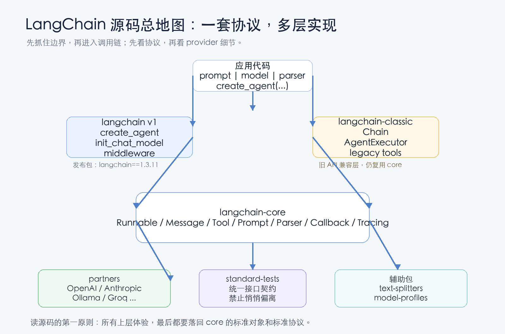
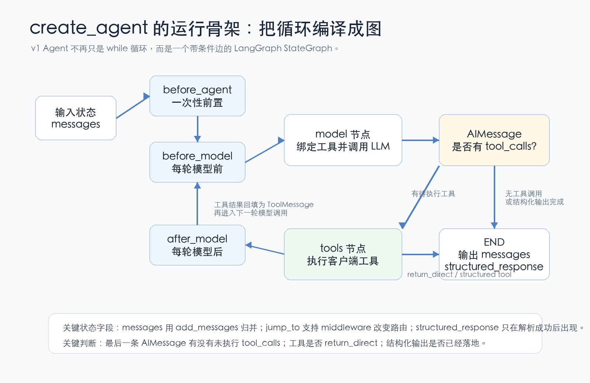

# LangChain源码解析01：先看懂Agent工程骨架

第一篇先不急着啃细节，而是把 LangChain 的主脉络、核心方法论和源码阅读路线搭起来。

很多人第一次接触 LangChain，会把它理解成“把 prompt、model、tool 串起来的库”。这当然没错，但如果只停在这个层面，很容易越用越糊：为什么一个 prompt 可以用 `|` 接模型？为什么 tool calling 能跨 OpenAI、Anthropic、Ollama 这些 provider？为什么 v1 的 Agent 看起来不像以前的 `AgentExecutor`？为什么一个模型调用能同时拥有同步、异步、批处理、流式和 tracing？

这一篇先做总地图。结论先放前面：

LangChain 的核心不是某个 Agent 模板，而是一套标准执行协议。上层所有“好用”的体验，最后都要落回 `Runnable`、`Message`、`Tool`、`Prompt`、`Parser`、`Callback` 这些标准对象。v1 的 Agent，则是在这套标准对象之上，用 LangGraph 把“模型调用、工具执行、结构化输出、middleware 插入点”编成一个状态图。



## 一、先看地图：LangChain 不是一个单层框架

从源码结构看，LangChain 更像一个分层系统：

- `langchain-core` 是协议层，定义可组合、可追踪、可序列化的标准对象。
- `langchain` v1 是新入口，负责 `create_agent`、`init_chat_model` 和 middleware 体系。
- `langchain-classic` 是旧 API 兼容层，保留传统 Chain、AgentExecutor、legacy tools。
- `partners` 是 provider 适配层，把 OpenAI、Anthropic 等模型 API 接到统一接口上。
- `standard-tests` 是契约层，用标准测试约束每个 integration 的行为。
- `text-splitters`、`model-profiles` 是外围能力，一个负责文档切分，一个负责模型能力数据。

这套分层的好处是：应用代码不用关心 provider 的细节，也不用每次为同步、异步、流式、批处理各写一套逻辑。只要对象遵守同一套协议，就能被组合进同一条链路。

## 二、核心方法论：先找协议，再找实现

读 LangChain 源码，最容易走偏的方式是从某个具体模型类一路往下翻。比如直接钻进 `ChatOpenAI`，很快就会被 Responses API、Chat Completions、tool schema、token usage、stream chunk 淹没。

更稳的读法是五步：

1. 先看数据形状：输入输出是不是 `Message`、`ToolCall`、`Document`、`ChatResult`。
2. 再看统一协议：这个对象是不是 `Runnable`，有没有 `invoke`、`stream`、`batch`。
3. 再看组合方式：它是怎么进入 `RunnableSequence`、`RunnableParallel` 或 graph 节点的。
4. 再看 provider 适配：外部 API 的 payload 和 response 在哪里被转换。
5. 最后看标准测试：这个行为是不是接口契约，还是某个 provider 的特例。

这也是后面整个系列的拆解方法。不是按文件名流水账，而是按“协议、运行时、适配层、契约测试”这条工程主线往下拆。

## 三、Runnable：LangChain 的地基

`Runnable` 是 LangChain 最重要的抽象之一。它定义的是“一段可执行工作”的统一形态：

```python
output = runnable.invoke(input)
async_output = await runnable.ainvoke(input)
chunks = runnable.stream(input)
results = runnable.batch(inputs)
```

真正厉害的地方不只是这几个方法，而是组合能力：

```python
chain = prompt | model | parser
```

这句代码能成立，是因为 prompt、model、parser 都能被看成 `Runnable`。`|` 会把它们组合成 `RunnableSequence`：前一个节点的输出，就是后一个节点的输入。

如果中间放一个字典，它会被转成 `RunnableParallel`，同一份输入会并发交给多个分支：

```python
chain = model | {
    "raw": parser_a,
    "summary": parser_b,
}
```

所以，LCEL 的本质不是“语法糖”，而是把同步、异步、批处理、流式和 tracing 都收进同一套执行协议里。上层 API 看起来轻，是因为底层协议足够重。

## 四、create_agent：把 Agent 循环编译成图

v1 的 `create_agent` 很值得单独看。它不是简单返回一个函数，也不是 classic 时代的 `AgentExecutor` 旧循环，而是构建一个 `StateGraph`。

可以把它的核心过程理解成四件事：

- 归一化模型：字符串模型名会交给 `init_chat_model`，变成具体 provider 的 chat model。
- 归一化工具：callable、`BaseTool`、provider built-in tool 会进入不同路径。
- 处理结构化输出：决定使用 provider-native schema，还是用“人工结构化工具”逼模型产出结构。
- 编译状态图：把 model、tools、middleware hooks 和条件边连起来。



这张图里有几个关键点：

第一，`messages` 是 Agent 的主状态。用户消息、AI 消息、ToolMessage 都在这条状态线上累积。

第二，模型节点每一轮都会根据当前 request 绑定工具。middleware 可以改模型、改工具、改系统消息、改 response format。

第三，工具节点不是永远跑。只有最后一条 `AIMessage` 里还有未执行的 `tool_calls`，才会进入工具节点。没有工具调用，或者结构化输出已经完成，就会走向结束。

第四，`return_direct` 会改变图边。如果某个工具声明执行后直接返回，tools 节点可以直接走向结束，而不是再回模型。

这就是 v1 Agent 和 classic Agent 最大的气质差异：classic 更像手写控制流，v1 更像“可插拔的状态机”。

## 五、init_chat_model：provider 适配的入口

`init_chat_model("openai:gpt-...")` 背后不是硬编码所有模型逻辑，而是一个 provider registry。

它先解析模型字符串：

- `openai:gpt-...` 会定位到 OpenAI integration。
- `anthropic:claude...` 会定位到 Anthropic integration。
- 如果没有 provider 前缀，会尝试根据模型名前缀做推断。

然后再懒加载对应包，比如 `langchain_openai.ChatOpenAI`、`langchain_anthropic.ChatAnthropic`。

这里还有一个很实用的设计：可配置模型。你可以先创建一个“还没定死 provider 的模型壳”，等运行时通过 config 决定具体模型。`bind_tools`、`with_structured_output` 这类声明式操作会先排队，等真实模型实例化后再应用。

这让“同一条链路切换模型”变得自然，也解释了为什么 `RunnableConfig` 在 LangChain 里不是边角料，而是运行时配置传递的核心机制。

## 六、Partner 包：复杂性被关进适配器

OpenAI、Anthropic 这些 provider 的 API 差异很大：

- 消息格式不同。
- 工具调用格式不同。
- 流式事件格式不同。
- usage metadata 不同。
- structured output 的支持方式也不同。

但 LangChain 希望上层只看到 `AIMessage`、`ToolCall`、`ChatResult`、`UsageMetadata` 这些标准对象。所以 partner 包的核心职责，就是做两次转换：

1. 调用前：把 LangChain 标准消息和工具 schema 转成 provider payload。
2. 调用后：把 provider response 转回 LangChain 标准对象。

这也是阅读 integration 代码时最重要的切入点：不要先看参数有多少，而要找“消息在哪里格式化、请求在哪里创建、响应在哪里还原、工具调用在哪里解析”。

## 七、standard-tests：为什么 integration 不容易跑偏

LangChain 的 provider 包很多，如果每个包都按自己的理解实现一套接口，上层体验很快就会碎掉。

`standard-tests` 的作用就是给 integration 立规矩。比如一个 chat model 是否支持 tool calling、structured output、image inputs、usage metadata、model override，都通过标准测试类表达出来。

更关键的是，标准测试不鼓励随便覆盖。如果某个 integration 的行为确实无法满足标准测试，要用带 reason 的 `xfail` 明确说明。这种机制很工程化：允许差异，但不能让差异悄悄发生。

## 八、第一篇的结论

如果只用一句话概括 LangChain 的源码脉络：

它用 `Runnable` 统一执行协议，用标准消息和工具对象统一数据形状，用 LangGraph 承载 v1 Agent 的运行时，用 partner 包隔离 provider 差异，再用 standard-tests 把集成质量锁住。

后面继续往下拆时，我们会反复回到这张地图。因为不管是模型调用、工具执行、结构化输出、middleware、streaming，还是 provider adapter，最后都绕不开同一个问题：

一段 LLM 应用逻辑，怎样被表达成可组合、可追踪、可替换、可测试的工程对象？

## 系列位置

当前文章：第 1 篇，先搭 LangChain 的源码总地图和阅读方法。

历史文章：本篇是系列开篇，暂无前文。后续已发布链接会在这里补齐。

源码参考：
GitHub: https://github.com/langchain-ai/langchain

如果模型决定调用一个工具，LangChain 是怎么让“工具参数校验、系统注入状态、回调追踪、ToolMessage 回填、下一轮模型调用”全部保持在同一条可解释链路里的？
