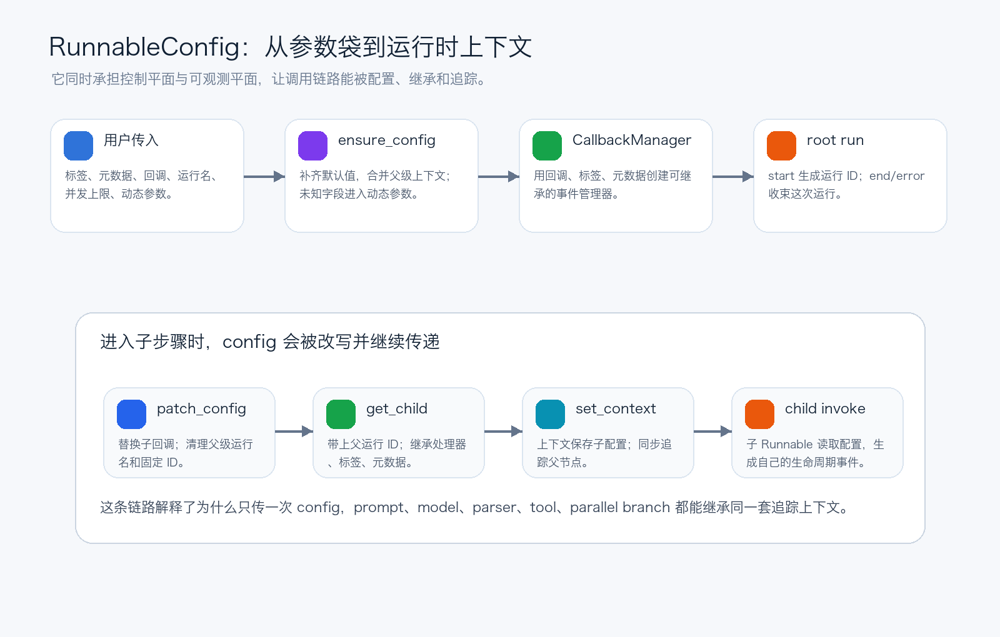
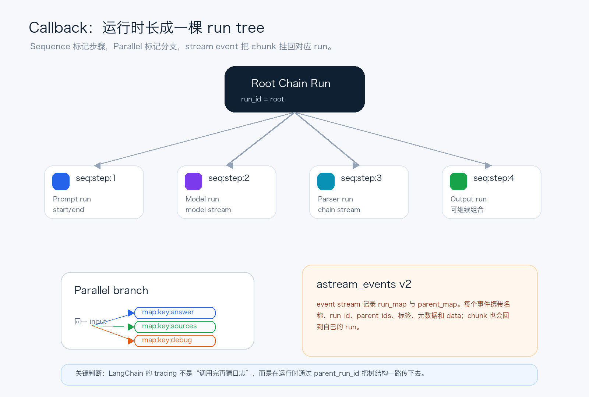

# LangChain源码解析03：RunnableConfig如何追踪到底

第三篇拆运行时上下文：一个 config，怎样让链路、分支、流式 chunk 都有来龙去脉。

第二篇讲 `Runnable` 时，我们已经看到一个关键事实：LangChain 的链路不是普通函数拼接，而是一套统一执行协议。

但还有一个问题没讲透：为什么你只是在最外层传了一个 `config`，LangChain 却能知道每个子步骤、每个并发分支、每个流式 chunk 属于哪一次调用？

第三篇就拆这个问题。结论先放前面：`RunnableConfig` 不是“参数袋”，而是 LangChain 的运行时上下文。它负责把配置、并发控制、动态参数、callback handler、tracing metadata 和父子 run 关系，一起带进整条链路。



*图 1：RunnableConfig 从外层参数变成可继承的运行时上下文*


## 一、先把 config 看成两条平面

从源码结构看，`RunnableConfig` 是一个 `TypedDict`。它故意不是一个必须填满的配置对象，而是 `total=False`：调用方可以只传一小部分，运行时再逐步补齐、合并和继承。

它里面的字段大致可以分成两类。

- 控制平面：`max_concurrency`、`recursion_limit`、`configurable`，决定这次调用怎么运行。
- 可观测平面：`tags`、`metadata`、`callbacks`、`run_name`、`run_id`，决定这次调用怎么被命名、过滤、追踪和归档。

这两个平面经常同时出现。比如你想临时切换模型，可能会通过 `configurable` 传入运行时模型选择；同时，你又希望 LangSmith 或自定义 callback 能知道这次调用的业务标签，就会传入 `tags` 和 `metadata`。

> 真正的重点不是字段多，而是这些字段会被子 Runnable 继承。否则它们只能影响最外层调用，无法解释一条复杂链路。


## 二、ensure_config：把不完整配置变成标准上下文

`ensure_config` 是理解这一层的第一扇门。它做三件事。

1. 先创建默认配置：空 `tags`、空 `metadata`、空 `configurable`、默认 `recursion_limit`，以及空 callback。
2. 如果当前上下文里已经有父级 config，就把父级可复制字段合并进来。
3. 再叠加这次调用显式传入的 config，并把未知 key 放入 `configurable`。

第三点很有意思。假设调用时传入一个非标准字段，只要它不属于 `RunnableConfig` 的标准 key，就会进入 `configurable`。这让运行时参数不必全部塞进函数签名，也能沿着 Runnable 链路继续向下传。

源码里还做了一个细节处理：`model`、`checkpoint_ns` 这类常见 configurable 字段，如果是字符串并且 metadata 里还没有，就会补进 metadata。这样追踪系统更容易按模型或 checkpoint namespace 做过滤。

不过这不是无限制地把所有配置都塞进追踪。LangSmith 相关 metadata 会过滤掉类似 `api_key` 这样的敏感字段。这个细节说明 LangChain 在“可观测性”和“不要泄漏秘密”之间做了边界控制。


## 三、CallbackManager：一次调用先变成一个 root run

`config` 被标准化之后，Runnable 会用它创建 callback manager。同步路径走 `get_callback_manager_for_config`，异步路径走 `get_async_callback_manager_for_config`。

这两个函数的核心动作，是把 `callbacks`、`tags`、`metadata` 配置成可继承的 callback manager。随后在真正执行时调用 `on_chain_start`，生成本次调用的 `run_id`，并把输入、名称、tags、metadata 交给 handler。

如果执行成功，会走 `on_chain_end`；如果执行异常，会走 `on_chain_error`。这就是一个 root run 的生命周期：start、stream、end 或 error。

```python
config = ensure_config(config)
callback_manager = get_callback_manager_for_config(config)
run_manager = callback_manager.on_chain_start(
    None,
    input,
    name=config.get("run_name") or self.get_name(),
    run_id=config.pop("run_id", None),
)
```

这一段看起来像普通的事件通知，但它实际建立了后面所有子步骤的父节点。没有 root run，后面的 prompt、model、parser、tool 就只是散落事件；有了 root run，它们才能挂成一棵树。


## 四、get_child：子步骤为什么能挂到父节点下面

第二篇提过，`RunnableSequence` 会给每一步创建类似 `seq:step:n` 的子 callback，`RunnableParallel` 会给每个分支创建类似 `map:key:<key>` 的子 callback。第三篇可以把这个动作讲得更细一点。

父级 `run_manager.get_child(tag)` 会创建一个新的 callback manager，并把 `parent_run_id` 设置成当前 run 的 `run_id`。同时，它会继承父级的 handlers、tags、metadata。也就是说，子步骤不是靠名字猜出来的，而是天然带着父 run 的身份证。

随后 `patch_config` 会把这个 child callback manager 写回 config。一个细节是：当 callbacks 被替换时，`patch_config` 会清理 `run_name` 和 `run_id`。这是为了避免父 run 的名字或固定 ID 错误套到子 run 上。

接着 `set_config_context` 把 child config 放进 `ContextVar`。这样即使子函数没有显式接收 config，下一层 `ensure_config` 仍然能从上下文里拿到父级配置。



*图 2：callback manager 通过 parent_run_id 把调用链路组织成 run tree*


## 五、Sequence 和 Parallel 是两种树形结构

`RunnableSequence.invoke` 的结构非常直接：启动 root run，然后按步骤推进。每一步执行前，都用 `seq:step:n` 创建 child callback，并在 child context 里调用对应步骤。

这意味着下面这条链：

```python
chain = prompt | model | parser
```

在 tracing 里不是一个扁平事件列表，而是一个 root chain run，下面挂着 prompt、model、parser 这些子 run。每个子 run 有自己的开始、流式输出、结束或错误。

`RunnableParallel` 的结构则是“同一输入，多条分支”。它给每个 key 创建 `map:key:<key>` 子 callback，并发执行每个分支。这样当某个分支报错或耗时很长时，你能知道问题出在哪个 key，而不是只看到整条链失败。

这就是 callback tag 的价值：它不是为了让日志好看，而是把组合结构变成可检索、可过滤、可定位的运行结构。


## 六、stream event：chunk 也要找到自己的 run

到了流式场景，事情会更复杂。一次调用不只是 start 和 end，中间还会不断吐出 chunk。LangChain 需要回答：这个 chunk 是哪个模型吐的？哪个 parser 处理的？它属于哪个父链路？

`astream_events(version="v2")` 就是围绕这个问题设计的。它产出的事件会带上 `event`、`name`、`run_id`、`parent_ids`、`tags`、`metadata` 和 `data`。其中 `parent_ids` 从 root 到直接父节点排序，正好对应前面 callback manager 建出来的 run tree。

内部的 event stream handler 会维护两张表：一张记录 run 本身的信息，一张记录 child 到 parent 的映射。start 事件登记 run，stream 事件把 chunk 发出去，end/error 事件再收尾。

`_transform_stream_with_config` 还有一个很工程化的处理：它会 tap 输出 iterator，边把 chunk 原样交给调用方，边让 streaming callback handler 生成对应事件。同时，它会尽量累积最终输入和最终输出，在结束事件里补齐上下文。

> 所以流式追踪不是“打印 token”。真正有价值的是：每个 chunk 都知道自己来自哪次 run、属于哪条父链路、携带哪些 tags 和 metadata。


## 七、异步和批处理为什么不容易丢上下文

还有一个细节很容易被忽略：LangChain 很多默认实现会把同步逻辑放进线程池，或者在 batch 里并发执行。如果上下文只存在普通局部变量里，跨线程和并发时就很容易断。

为了解决这个问题，`ContextThreadPoolExecutor` 在提交任务时会复制当前 context；`run_in_executor` 在默认 executor 路径里也会用 `copy_context().run(...)`。这保证了 `ContextVar` 里的 child config 能随着并发任务一起过去。

`get_config_list` 则处理 batch 场景：如果传入的是一组 config，它要求长度和输入数量一致；如果批量调用里传了固定 `run_id`，只有第一个输入会使用它，后续输入会移除这个 ID。否则多个 run 共用一个 ID，追踪树就会混乱。

这说明 LangChain 对 tracing 的要求不是“能看到日志就行”，而是每一次调用都必须有清晰边界。边界不清楚，可观测性就会变成噪音。


## 八、这一层源码应该怎么读

读 `RunnableConfig` 和 callback 这层时，可以抓住四个问题：

1. 这次调用的标准 config 是在哪里补齐的？
2. 父级 config 是通过显式参数传下去，还是通过 context 继承下去？
3. 每个子 Runnable 的 callback manager 是用什么 tag 创建的？
4. stream event 里的 `run_id`、`parent_ids`、`tags`、`metadata` 能不能还原出运行结构？

只要这四个问题能回答清楚，LangChain 的 tracing、streaming、batch、Agent middleware，后面都会好理解很多。因为它们都离不开同一个动作：把一次复杂调用拆成有父子关系的运行单元。


## 九、第三篇的结论

`RunnableConfig` 的厉害之处，不在于它能传几个参数，而在于它把运行时上下文变成了可继承、可改写、可追踪的结构。

外层调用通过 `ensure_config` 变成标准上下文；root run 通过 callback manager 建立生命周期；子步骤通过 `get_child` 和 `patch_config` 挂到父节点下面；流式事件再通过 `run_id` 和 `parent_ids` 把 chunk 放回正确位置。

理解这一层之后，你会发现 LangChain 的可观测性不是额外贴上的功能，而是执行协议的一部分。它从第一步调用开始，就在为后面的调试、回放、评估和生产监控留下结构化线索。


## 系列位置

当前文章：第 3 篇，拆 `RunnableConfig`、callback 和 tracing 传递。

历史文章：
第 2 篇：[LangChain源码解析02：Runnable把一切串起来](https://mp.weixin.qq.com/s/cOYJN_7pZ3FZbVRdAD95ww)
第 1 篇：`LangChain源码解析01：先看懂Agent工程骨架`，发布链接待补齐。

源码参考：
GitHub: https://github.com/langchain-ai/langchain

当模型输出不再是单纯字符串，而是 HumanMessage、AIMessage、ToolMessage、content blocks 和 tool_calls 这些结构时，LangChain 又是怎么把它们变成统一的数据形状的？
