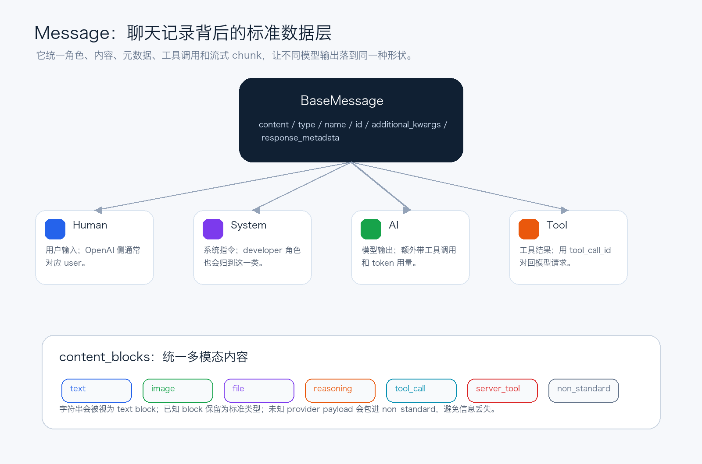
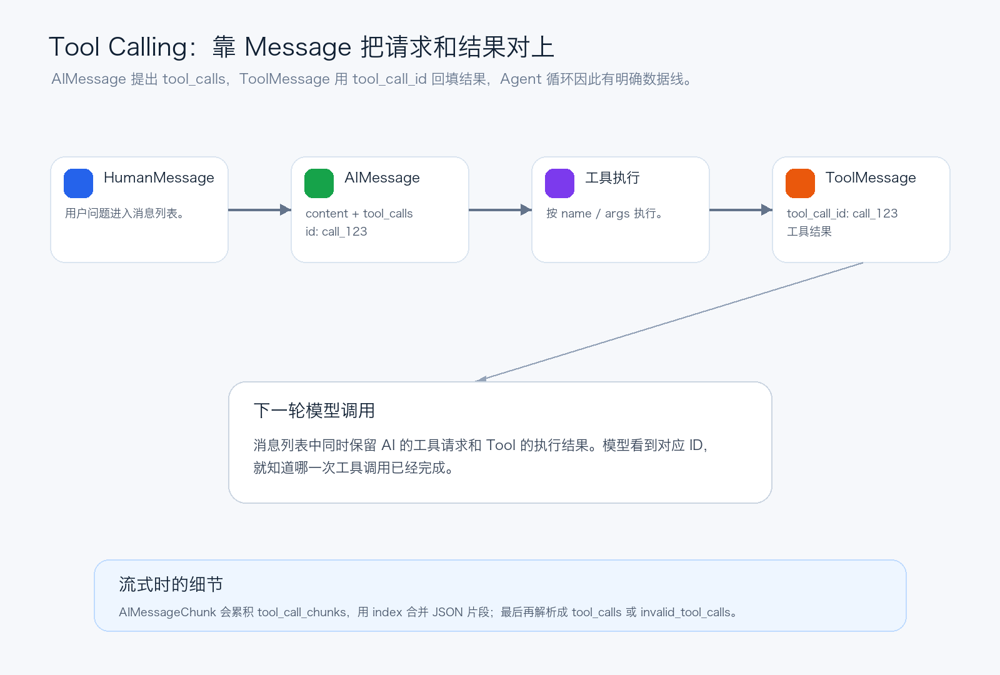

# LangChain源码解析04：Message不只是字符串

第四篇拆对话数据层：Human、AI、Tool、content blocks 和 tool_calls 如何被统一成工程对象。

前三篇分别拆了 `Runnable`、`RunnableConfig` 和 callback/tracing。到这里，LangChain 的“怎么运行”和“怎么追踪”已经比较清楚了。

第四篇该拆另一个更容易被低估的基础层：`Message`。

很多人把消息理解成聊天记录，或者简单理解成 role + content。这个理解能跑通最简单的聊天，但一旦进入 tool calling、多模态、流式输出、结构化内容、provider 适配，就会不够用了。

LangChain 的 Message 体系真正解决的是：不同模型返回的复杂对话数据，怎样统一成一个上层能组合、能追踪、能序列化、能传给下一轮模型的标准对象。

*图 1：Message 体系把角色、内容、工具调用和多模态 block 统一起来*

## 一、BaseMessage：所有消息先共享一组核心字段

从源码结构看，所有具体消息类型都继承自 `BaseMessage`。它的核心字段并不复杂：

- `content`：消息主体，可以是字符串，也可以是字符串和 dict block 的列表。
- `additional_kwargs`：保留 provider 原始附加信息，比如某些模型返回的原生 tool call payload。
- `response_metadata`：响应元信息，比如模型名、header、logprob、provider 标识。
- `type`：消息类型，用于序列化和反序列化。
- `name`：可选的人类可读名称。
- `id`：可选消息 ID，通常由 provider 或运行时生成。

这组字段体现了一个很重要的工程判断：标准化不等于丢掉原始信息。LangChain 会尽量把通用信息放进标准字段，同时把暂时不统一、或者 provider 特有的字段留在 `additional_kwargs` / `response_metadata` 里。

这也是为什么 Message 不是一层薄薄的字符串包装。它既要服务上层统一 API，也要给底层 provider adapter 留出足够空间。

## 二、Human、System、AI、Tool：角色不是字符串枚举那么简单

最常见的四类消息是 `HumanMessage`、`SystemMessage`、`AIMessage` 和 `ToolMessage`。

`HumanMessage` 表示用户输入，转换到 OpenAI 格式时通常对应 `user`。`SystemMessage` 表示系统指令，OpenAI 的 `developer` 角色也会通过额外字段归到这一类处理。

`AIMessage` 是模型输出，但它比“assistant 文本”重得多。它不仅有 content，还有 `tool_calls`、`invalid_tool_calls`、`usage_metadata`。这些字段决定了 Agent 能不能识别模型要调用什么工具、参数是否解析成功、token 用量能不能统一统计。

`ToolMessage` 则是工具执行结果。它有一个非常关键的字段：`tool_call_id`。这个 ID 用来把工具结果和前一条 AI 消息中的某个 tool call 对上。没有这个 ID，并发工具调用就很难可靠回填。

> 所以 Message 的角色设计，不只是为了区分谁说话，而是为了让模型调用、工具执行、结果回填、下一轮推理能连成一条明确的数据链。

## 三、content_blocks：统一多模态内容

在早期聊天 API 里，content 常常只是字符串。但现在模型输入输出越来越复杂：文本、图片、音频、文件、引用、推理过程、工具调用、服务端工具结果，都可能出现在一条消息里。

LangChain 通过 `content_blocks` 把这些内容标准化为一组 typed dict。常见 block 包括：

- `text`：普通文本。
- `image`、`audio`、`video`、`file`、`text-plain`：多模态数据。
- `reasoning`：模型推理或思考摘要。
- `tool_call`、`tool_call_chunk`、`invalid_tool_call`：工具调用及其流式片段。
- `server_tool_call`、`server_tool_result`：模型服务端执行的工具调用和结果。
- `non_standard`：暂时无法标准化的 provider 特有 payload。

`BaseMessage.content_blocks` 的处理策略很务实：字符串会变成 text block；已知标准 block 原样保留；未知 block 会先包成 `non_standard`，再尝试通过各种 translator 转成标准结构。

这个设计很重要。它避免了两个极端：一端是只支持最小公约数，导致 provider 新能力全部丢失；另一端是每个 provider 都暴露自己的格式，导致上层应用完全不可移植。

## 四、AIMessage：模型输出的标准化中心

`AIMessage` 是 Message 体系里最重的一类。因为模型输出不只是回答，还可能包含工具调用、usage、reasoning、provider 原始响应。

它的 `content_blocks` 逻辑会先看 `response_metadata` 里的 `model_provider`。如果知道 provider，就优先使用对应 translator；如果没有 translator，才退回到 `BaseMessage` 的 best-effort 解析。

此外，如果 `AIMessage.tool_calls` 里有工具调用，而 content 中缺少对应 `tool_call` block，它会把这些 tool calls 补进 content blocks。这样无论工具调用来自标准字段，还是来自 provider 原始结构，最终上层都能看到统一的 `tool_call` 形状。

`invalid_tool_calls` 也值得注意。模型有时会生成格式不合法的工具参数，比如 JSON 不完整。LangChain 不会简单吞掉这类错误，而是把它们放进 invalid tool call 结构里，让上层决定是重试、报错还是让模型修正。

## 五、ToolMessage：工具结果靠 ID 回到对话里

tool calling 的数据链路可以简化成四步：

1. 用户问题进入 `HumanMessage`。
2. 模型返回 `AIMessage`，其中带着 `tool_calls`。
3. 运行时根据 tool call 的 name 和 args 执行工具。
4. 工具结果被包装成 `ToolMessage`，用 `tool_call_id` 对应原来的 tool call。

*图 2：AIMessage.tool_calls 与 ToolMessage.tool_call_id 共同维持工具调用闭环*

`ToolMessage` 的 content 是要回填给模型看的内容；`artifact` 可以保存不直接发给模型的完整工具产物，比如完整 stdout、图片、文件、调试信息。`status` 则区分 success 和 error。

这解释了为什么 LangChain 不把工具结果简单塞回一条 AI 文本里。工具结果是一种独立消息，它要被模型识别为“某个工具调用的返回值”，还要能和并发工具调用一一对应。

## 六、流式消息：chunk 不是简单字符串相加

流式输出时，模型不会一次性给出完整 `AIMessage`，而是吐出一段段 `AIMessageChunk`。这些 chunk 可以相加，最终合并成完整消息。

普通文本 chunk 合并还比较直观，难点在 tool call。模型可能先吐出工具名，再一点点吐出 JSON 参数。LangChain 用 `ToolCallChunk` 表示这些片段，并用 `index` 把同一个工具调用的片段合并起来。

当 chunk 聚合到最后，`AIMessageChunk` 会尝试把 JSON 参数解析成 dict。如果解析成功，就进入 `tool_calls`；如果解析失败，就进入 `invalid_tool_calls`。

这就是流式 tool calling 能工作的关键：一边允许模型增量输出，一边在最终形成结构化 tool call 时保留错误边界。

## 七、provider translator：标准格式和外部 API 之间的桥

不同 provider 的消息格式差异非常大。OpenAI、Anthropic、Bedrock、Google GenAI 对图片、文件、工具调用、reasoning 的表达方式都不完全一样。

LangChain 的 block translator 负责做两类转换：

- 输入侧：把用户传入的各种 provider 格式或旧版多模态格式，尽量转成标准 content blocks。
- 输出侧：如果 `response_metadata.model_provider` 已知，就用对应 translator 把 provider 输出转成标准 blocks。

比如 OpenAI Chat Completions 的 assistant tool calls 会被转成标准 `tool_call` block；Anthropic 的 document/image/source 结构会被尽量转成标准 file/image/text-plain block。转不了的内容则保留为 `non_standard`。

这层桥接让上层应用可以尽量面向 LangChain 标准消息编程，而不是在业务代码里到处判断“这是 OpenAI 格式还是 Anthropic 格式”。

## 八、MessageLike：为什么字符串和 dict 也能进链路

LangChain 为了使用方便，还支持多种 message-like 输入：字符串、`(role, content)` 二元组、dict、`BaseMessage` 实例、PromptValue。

`convert_to_messages` 会把这些输入统一转成 `BaseMessage` 列表。比如字符串会被当成 human message；role 为 `assistant` 会进入 `AIMessage`；role 为 `tool` 会进入 `ToolMessage`。

这里有一个安全边界：反序列化 constructor-envelope 形状时，源码使用固定 allowlist 把类名映射到 message type，而不是动态加载任意类。这是一个小但重要的设计，避免消息转换变成任意类实例化入口。

此外，`filter_messages`、`merge_message_runs` 这类工具还被包装成 Runnable 友好的函数：不传 messages 时，它们会返回 `RunnableLambda`。这说明 Message 工具函数也能自然进入 LCEL 链路。

## 九、第四篇的结论

如果说 `Runnable` 统一了执行协议，`RunnableConfig` 统一了运行时上下文，那么 `Message` 统一的就是 LLM 应用里最核心的数据形状。

它把用户输入、系统指令、模型输出、工具请求、工具结果、多模态内容、provider 原始 payload、流式 chunk 和 token usage 放在一套对象模型里。

理解 Message 体系之后，再看 tool calling、structured output、Agent 状态图和 provider adapter，就会更顺：上层看见的是一组标准消息，底层负责把不同 provider 的差异翻译进来或翻译出去。

## 系列位置

当前文章：第 4 篇，拆 Message 体系、content blocks 和 tool call 数据链。

历史文章：
第 3 篇：`LangChain源码解析03：RunnableConfig如何追踪到底`，发布链接待补齐。
第 2 篇：[LangChain源码解析02：Runnable把一切串起来](https://mp.weixin.qq.com/s/cOYJN_7pZ3FZbVRdAD95ww)
第 1 篇：`LangChain源码解析01：先看懂Agent工程骨架`，发布链接待补齐。

源码参考：
GitHub: https://github.com/langchain-ai/langchain

当 Message 已经能表达工具调用和工具结果之后，LangChain 又是怎么从普通 Python 函数推导出工具 schema，并把运行时注入参数和模型可见参数分开的？

---

## 源码审查笔记

写作基于 `1.3.11` 分支下的 LangChain Python monorepo，重点阅读：

- `libs/core/langchain_core/messages/base.py`
  - `BaseMessage`：统一 `content`、`additional_kwargs`、`response_metadata`、`type`、`name`、`id`。
  - `content_blocks`：把字符串转为 text block，把未知 provider payload 包成 `non_standard`，再通过多轮 translator 尝试标准化。
  - `BaseMessageChunk` / `merge_content`：支持流式 chunk 合并。
- `libs/core/langchain_core/messages/human.py`、`system.py`
  - `HumanMessage` 与 `SystemMessage` 的基础 role 类型。
- `libs/core/langchain_core/messages/ai.py`
  - `AIMessage`：标准化 `tool_calls`、`invalid_tool_calls`、`usage_metadata`。
  - `AIMessage.content_blocks`：优先使用 `response_metadata.model_provider` 对应 translator；否则 best-effort 解析，并补齐 `tool_calls` block。
  - `_backwards_compat_tool_calls`：从 `additional_kwargs["tool_calls"]` 解析旧格式工具调用。
  - `AIMessageChunk`：通过 `tool_call_chunks`、`chunk_position`、`parse_partial_json` 合并并解析流式 tool call。
- `libs/core/langchain_core/messages/tool.py`
  - `ToolMessage`：通过 `tool_call_id` 关联 tool call 请求与工具结果，支持 `artifact` 与 `status`。
  - `ToolCall`、`ToolCallChunk`、`InvalidToolCall`、`default_tool_parser`、`default_tool_chunk_parser`。
- `libs/core/langchain_core/messages/content.py`
  - 标准 `ContentBlock` 定义：text、image、audio、video、file、text-plain、reasoning、tool_call、server_tool_call、server_tool_result、non_standard 等。
  - factory functions：`create_text_block`、`create_image_block`、`create_tool_call` 等。
- `libs/core/langchain_core/messages/block_translators/*`
  - provider-specific content translator registry；`AIMessage.content_blocks` 会根据 `model_provider` 选用。
  - OpenAI translator 将 Chat Completions tool calls 转为标准 `tool_call` block；Anthropic translator 将 document/image/source 等结构尽量转为标准 data blocks。
- `libs/core/langchain_core/messages/utils.py`
  - `convert_to_messages` / `_convert_to_message`：支持 BaseMessage、字符串、二元组、dict、PromptValue 等 message-like 输入。
  - `_create_message_from_message_type`：role 到具体 Message 类型的归一化，包括 `assistant` -> `AIMessage`、`tool` -> `ToolMessage`。
  - `_LC_CONSTRUCTOR_NAME_TO_TYPE`：constructor-envelope 反序列化使用固定 allowlist，而不是动态实例化任意类。
  - `convert_to_openai_messages`：把 LangChain messages 转回 OpenAI message dict。
  - `filter_messages`、`merge_message_runs` 支持 Runnable 化。

公开版不放长路径和源码行号，避免公众号正文过重；这些细节保留在源稿笔记中，方便后续回查。
