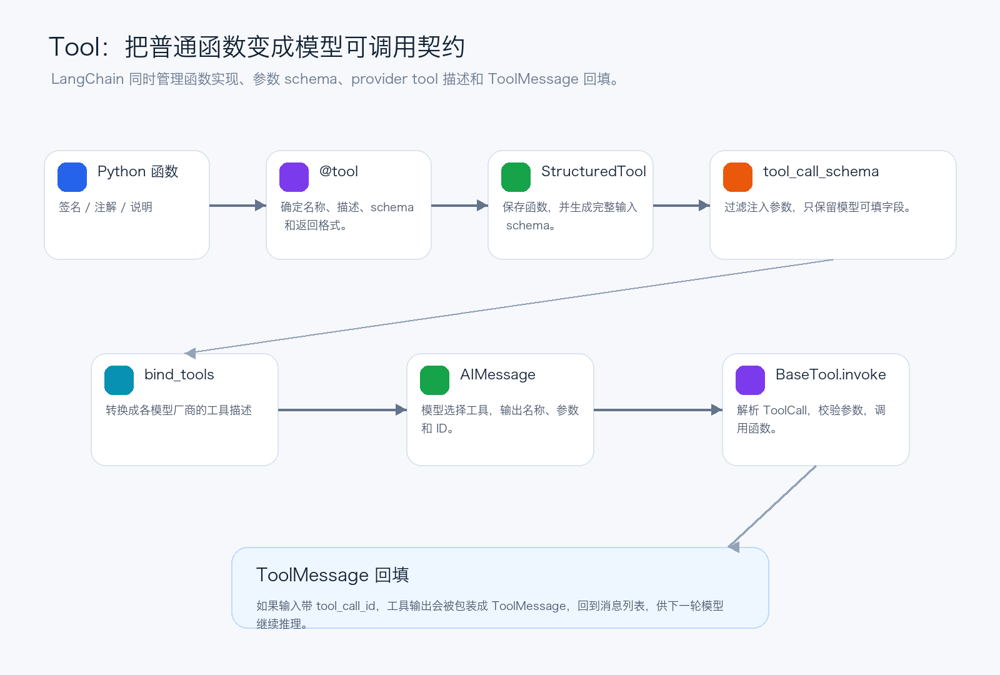
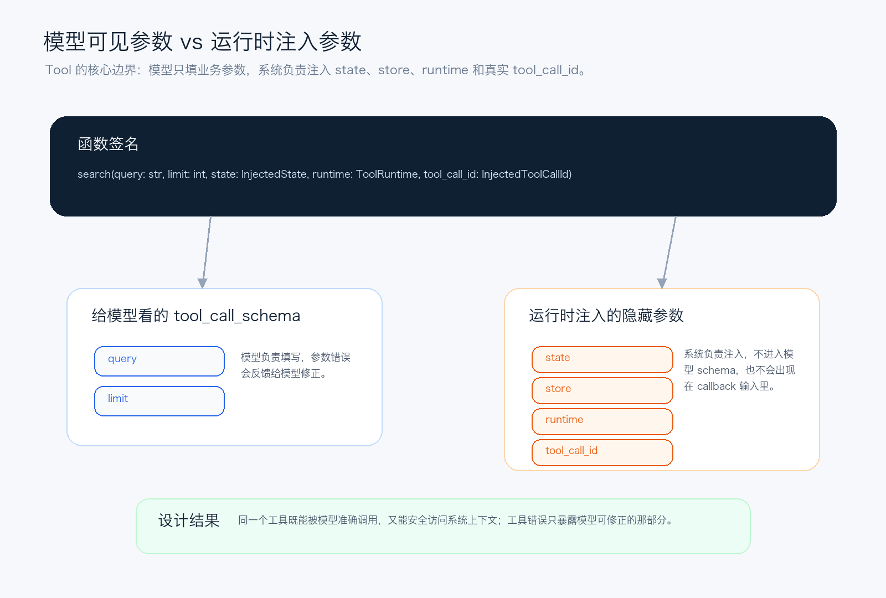

# LangChain源码解析05：Tool如何从函数变成契约

第五篇拆工具层：@tool、BaseTool、schema 推导、注入参数和 ToolMessage 如何把普通函数接进 Agent 循环。

前四篇已经把 `Runnable`、`RunnableConfig`、callback/tracing 和 `Message` 体系串起来了。到这里，我们已经知道 LangChain 怎样运行一段链路，怎样传递运行时上下文，怎样把模型、用户和工具结果统一成消息。

第 5 篇进入工具层：`Tool`。

很多人第一次使用 LangChain 工具时，看到的是一个很轻的写法：给 Python 函数加一个 `@tool` 装饰器，然后把它丢给 Agent。这个体验故意做得很薄，但源码里的设计并不薄。

Tool 真正解决的问题是：怎样把一个普通 Python 函数，变成模型能理解、运行时能校验、Agent 能追踪、结果能回填到消息列表里的工程契约。



*图 1：Tool 从函数到模型契约再到 ToolMessage 回填的主链路*

## 一、Tool 不是函数，而是一份三方契约

从源码结构看，Tool 至少同时服务三方。

- `模型`：需要知道有哪些工具、每个工具叫什么、什么时候用、参数结构是什么。
- `运行时`：需要校验模型给的参数，注入系统上下文，执行同步或异步函数。
- `消息链路`：需要把工具结果包装成 `ToolMessage`，用 `tool_call_id` 对回前一条 `AIMessage.tool_calls`。

所以 Tool 不能只是 `callable`。如果只保存一个函数对象，模型不知道怎么调用；如果只保存 JSON schema，运行时又不知道怎么执行；如果只执行函数，Agent 又无法把结果放回上一篇讲过的 Message 闭环。

LangChain 的答案是 `BaseTool`：它继承自 Runnable，把工具变成可 `invoke` / `ainvoke` 的组件，同时额外维护 `name`、`description`、`args_schema`、`tool_call_schema`、`response_format`、错误处理和 callback 信息。

## 二、@tool：最薄的入口，最重的后处理

`@tool` 是最常见的入口。它看起来只是装饰器，但实际会判断传入的是普通函数、异步函数，还是 Runnable。普通函数最终通常会进入 `StructuredTool.from_function`。

这一层主要做几件事：确定工具名，确定描述，保存 `func` / `coroutine`，决定是否从函数签名推导 schema，设置 `return_direct` 和 `response_format`。

```python
from langchain.tools import tool


@tool(parse_docstring=True)
def search_docs(query: str, limit: int = 5) -> str:
    """Search internal documents.

    Args:
        query: Search query.
        limit: Maximum number of results.
    """
    return "..."
```

上面这种写法背后，LangChain 会把函数签名里的 `query`、`limit` 变成参数 schema，把 docstring 摘要变成工具描述，把 Args 里的说明变成字段描述。模型看到的不是 Python 函数，而是一份结构化工具说明。

这里有一个设计取向：LangChain 尽量让工具声明贴近 Python 习惯，但不会把 Python 细节原封不动暴露给模型。模型需要的是稳定、清晰、可校验的参数契约。

## 三、create_schema_from_function：签名如何变成 Pydantic schema

`create_schema_from_function` 是工具 schema 推导的核心。它会读取函数签名，结合类型注解和 docstring，用 Pydantic 生成输入模型。

它做的事情可以拆成四步：

1. 读取 `inspect.signature(func)`，确认参数列表。
2. 用 Pydantic 的参数校验能力生成临时模型。
3. 过滤不该出现在 schema 里的框架参数，比如 `run_manager`、`callbacks`，以及 RunnableConfig 对应参数。
4. 把 docstring 或 `Annotated` 里的描述补进字段描述。

这就是为什么工具函数最好写清楚类型注解和描述。工具描述不是给人看的注释而已，它会进入模型上下文，直接影响模型是否会选中工具、是否会填对参数。

如果开启 `parse_docstring=True`，LangChain 会按 Google-style docstring 解析参数说明；如果 docstring 参数和函数签名对不上，还会报错。这不是吹毛求疵，而是避免给模型一份错误契约。

## 四、两个 schema：运行时校验和模型可见不是一回事

Tool 体系里有一个非常关键的分层：`get_input_schema()` 和 `tool_call_schema` 不完全等价。

`get_input_schema()` 更偏运行时输入校验，它可以包含工具真正执行所需要的完整参数。`tool_call_schema` 则是给模型看的 schema，会过滤掉运行时注入参数。



*图 2：Tool 把模型可见参数和运行时注入参数分开*

这个分层非常重要。比如一个工具需要 `query` 和 `limit` 让模型填写，同时还需要 `state`、`store`、`runtime` 访问系统上下文。如果这些字段全部暴露给模型，模型会被迫填写它根本不该知道的值，甚至可能把安全边界搞乱。

`BaseTool.tool_call_schema` 会从完整 schema 里挑出非注入字段，再生成一个子模型。源码还对这个子模型做了 memo，并缓存 JSON schema。原因很现实：Agent 每一轮模型调用都可能绑定工具，如果每次都重新构造 schema，热路径会白白损耗。

## 五、InjectedToolArg：模型不该填的参数，运行时来填

LangChain 用 `InjectedToolArg` 标记运行时注入参数，用 `InjectedToolCallId` 专门注入当前工具调用的真实 ID。还有一类直接注入参数，例如 `ToolRuntime`，它不需要写成 `Annotated[..., InjectedToolArg]`，只要类型本身表示运行时注入即可。

```python
from typing import Annotated

from langchain.tools import ToolRuntime, tool
from langchain_core.messages import ToolMessage
from langchain_core.tools import InjectedToolCallId


@tool
def save_note(
    note: str,
    runtime: ToolRuntime,
    tool_call_id: Annotated[str, InjectedToolCallId],
) -> ToolMessage:
    """Save a note for the current session."""
    user_id = runtime.context.get("user_id", "anonymous")
    return ToolMessage(
        content=f"saved for {user_id}: {note}",
        tool_call_id=tool_call_id,
    )
```

这段函数里，模型只应该看到 `note`。`runtime` 来自系统，`tool_call_id` 来自模型上一轮产生的 ToolCall 外层 ID。尤其是 `InjectedToolCallId`，源码会确保使用真实调用 ID，而不是信任模型在 args 里伪造的同名字段。

这也是工具层的安全边界：模型负责业务参数，系统负责上下文和身份。测试里也能看到，工具参数校验失败时，错误消息只应该包含模型可修正的参数问题，不应该把 `state`、`store`、`runtime` 或其中的敏感值暴露给模型。

## 六、执行路径：ToolCall 进来，ToolMessage 出去

工具执行时，`BaseTool.invoke()` 会先调用 `_prep_run_args`。如果输入是完整 ToolCall，也就是包含 `type='tool_call'`、`name`、`args`、`id` 的结构，LangChain 会取出 `args` 作为工具入参，把外层 `id` 作为 `tool_call_id`。

然后 `_parse_input()` 根据 `args_schema` 做校验和默认值处理；`_to_args_and_kwargs()` 把输入转成函数需要的位置参数或关键字参数；最后调用 `_run()` 或 `_arun()`。

工具返回值会进入 `_format_output()`。如果存在 `tool_call_id`，普通结果会被包装成 `ToolMessage`，并带上工具名、调用 ID 和状态。这样下一轮模型就能知道：哪一次工具调用已经返回了什么结果。

`response_format='content_and_artifact'` 也在这里发挥作用。此时工具应该返回 `(content, artifact)` 二元组：`content` 是回填给模型看的内容，`artifact` 可以保存完整原始产物，比如大对象、文件信息或调试数据。上一篇讲 `ToolMessage.artifact` 时留下的那条线，在工具执行层这里接上了。

## 七、错误处理：不要让一次工具失败直接炸掉整个 Agent

`BaseTool` 提供了两类错误处理入口：`handle_validation_error` 和 `handle_tool_error`。前者处理参数校验错误，后者处理工具主动抛出的 `ToolException`。

如果不配置处理器，错误会继续抛出；如果配置为 `True`、字符串或 callable，错误会被转成工具输出。只要这次执行有 `tool_call_id`，这份错误输出也会变成 `status='error'` 的 `ToolMessage`，回到消息列表里。

这给 Agent 留了修复空间：模型可以看到“这次工具调用哪里错了”，然后重新生成参数，而不是让整个调用链在第一处异常上终止。

## 八、provider adapter：统一 Tool，再翻译给不同模型

Tool schema 最终要被发给模型。不同 provider 的工具格式并不完全一致，所以 LangChain 先维护一套统一的 `BaseTool` 语义，再由 adapter 翻译。

OpenAI 侧会通过 `convert_to_openai_tool` / `convert_to_openai_function` 把 `BaseTool.tool_call_schema` 转成 OpenAI tool schema。Anthropic 侧也会把同样的工具对象转成 Anthropic 需要的格式。

这就是 Tool 层和 provider 层之间的边界：应用代码尽量面向 `BaseTool`、`@tool` 和 Python 类型系统编程；不同模型 API 的细节交给对应集成包处理。

## 九、第五篇的结论

Tool 体系的核心，不是让你少写几行函数包装代码，而是把“模型想调用能力”和“程序真实执行能力”之间的边界做清楚。

它用 `@tool` 降低声明成本，用 `create_schema_from_function` 生成参数契约，用 `tool_call_schema` 隔离模型可见字段，用注入参数承载系统上下文，用 `_format_output` 把结果重新放回 Message 体系。

理解这一层之后，再看 Agent 的工具节点、middleware 的工具拦截、structured output 的 ToolStrategy，就不会觉得它们是独立功能。它们都建立在同一个判断上：模型只负责提出结构化请求，运行时负责把请求安全地变成真实动作。

## 系列位置

当前文章：第 5 篇，拆 Tool 体系、schema 推导、运行时注入和 ToolMessage 回填。

历史文章：
第 4 篇：`LangChain源码解析04：Message不只是字符串`，发布链接待补齐。
第 3 篇：`LangChain源码解析03：RunnableConfig如何追踪到底`，发布链接待补齐。
第 2 篇：[LangChain源码解析02：Runnable把一切串起来](https://mp.weixin.qq.com/s/cOYJN_7pZ3FZbVRdAD95ww)
第 1 篇：`LangChain源码解析01：先看懂Agent工程骨架`，发布链接待补齐。

源码参考：
GitHub: https://github.com/langchain-ai/langchain

当工具已经能把模型请求变成真实动作之后，LangChain 又是怎样在 Prompt 和 output parser 两端继续约束输入输出形状，让链路不只会执行，而且能稳定地产生可消费结果的？
---

## 源码审查笔记

写作基于 `1.3.11` 分支下的 LangChain Python monorepo，重点阅读：

- `libs/core/langchain_core/tools/convert.py`
  - `tool` 装饰器根据普通函数、异步函数或 Runnable 创建工具。
  - 普通函数路径最终进入 `StructuredTool.from_function`。
  - `response_format="content_and_artifact"` 会要求工具返回 `(content, artifact)`。
- `libs/core/langchain_core/tools/structured.py`
  - `StructuredTool` 保存 `func` / `coroutine`。
  - `from_function` 负责选择名称、描述、schema 推导和响应格式。
  - `_filter_schema_args` 过滤 `callbacks`、`run_manager` 和 RunnableConfig 参数。
- `libs/core/langchain_core/tools/base.py`
  - `create_schema_from_function` 从函数签名、类型注解和 docstring 生成 Pydantic schema。
  - `BaseTool.tool_call_schema` 过滤 `InjectedToolArg` / `InjectedToolCallId` / 直接注入参数。
  - `_prep_run_args` 识别完整 ToolCall，并抽取 `args` 与外层 `id`。
  - `_parse_input` 校验参数并注入真实 `tool_call_id`。
  - `_format_output` 在存在 `tool_call_id` 时把工具结果包装为 `ToolMessage`。
  - `_filter_injected_args` 避免 callback 输入包含运行时注入参数。
- `libs/core/langchain_core/utils/function_calling.py`
  - `_format_tool_to_openai_function` 使用 `tool.tool_call_schema` 生成 OpenAI function 描述。
  - `convert_to_openai_tool` 将 `BaseTool`、函数、Pydantic schema 或 dict 统一转成 OpenAI tool schema。
- `libs/partners/openai/langchain_openai/chat_models/base.py`
  - `bind_tools` 调用 `convert_to_openai_tool`，并处理 `strict`、`tool_choice`、`parallel_tool_calls`。
- `libs/partners/anthropic/langchain_anthropic/chat_models.py`
  - `bind_tools` 接收 `BaseTool` / dict / Pydantic / callable，再转成 Anthropic 工具格式。
- `libs/langchain_v1/langchain/tools/tool_node.py`
  - `ToolRuntime`、`InjectedState`、`InjectedStore` 从 LangGraph prebuilt 重新导出。
- `libs/core/tests/unit_tests/test_tools.py`
  - 覆盖注入参数过滤、`InjectedToolCallId` 注入、`content_and_artifact`、`tool_call_schema` 缓存。
- `libs/langchain_v1/tests/unit_tests/agents/test_create_agent_tool_validation.py`
  - 验证工具错误消息只暴露模型可控参数，不泄露 state/store/runtime 及其敏感值。

## 维护提示

- 公众号公开版不要暴露本节内容。
- 公开版应只保留架构、源码行为和设计判断。
- 若第 3、4 篇发布后拿到公开 URL，需要同步更新系列链接。
