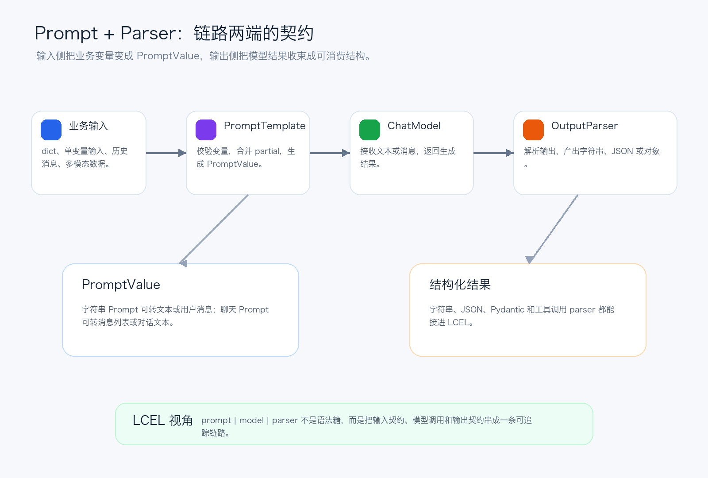
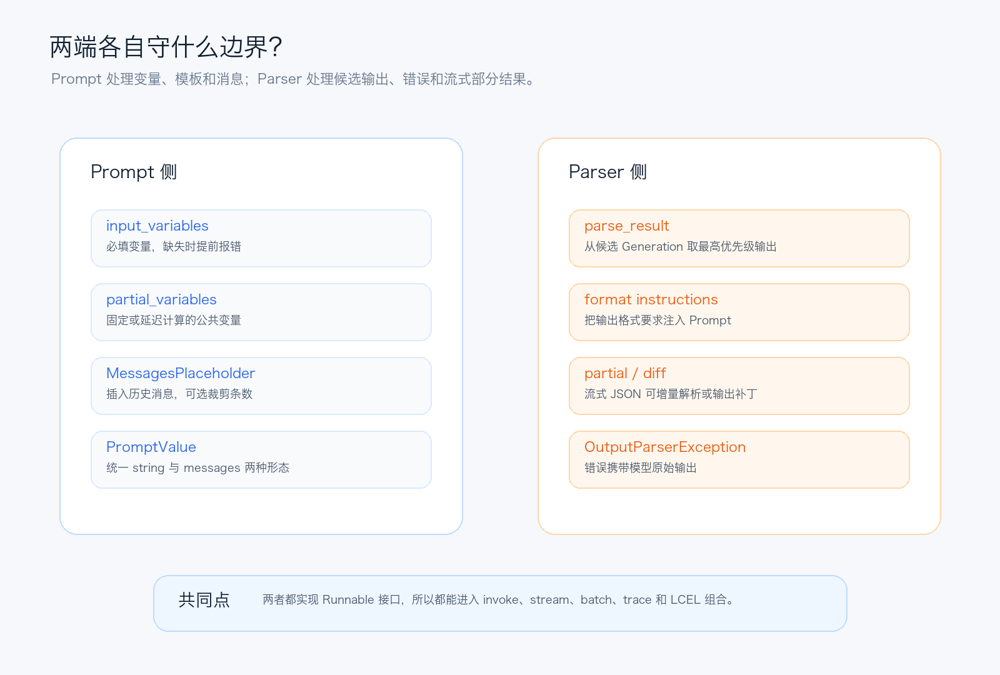

# LangChain源码解析06：Prompt和Parser守住两端

第六篇拆输入输出契约：Prompt 如何把业务变量变成 PromptValue，OutputParser 如何把模型文本收束成可消费结构。

上一篇拆 Tool 时，我们看到 LangChain 会把普通 Python 函数变成模型可调用的契约：模型负责填参数，运行时负责执行和回填结果。

但工具只是 Agent 循环里的动作层。再往外看，LLM 应用还有两个更基础的边界：模型调用前，业务输入怎样变成提示词；模型调用后，自然语言输出怎样变成程序能继续消费的数据。

第 6 篇就拆这两个边界：`Prompt` 和 `OutputParser`。

它们看起来一个在前、一个在后，但源码里的设计很对称：二者都是 Runnable，都能进入 LCEL，都能被 tracing 记录。Prompt 守住输入形状，Parser 守住输出形状。



*图 1：Prompt 和 Parser 分别守住模型调用的输入输出两端*

## 一、Prompt 不是字符串拼接，而是输入契约

从源码结构看，所有 Prompt 模板都继承自 `BasePromptTemplate`。它的字段里最重要的是这几组：

- `input_variables`：调用者必须传入的变量。
- `optional_variables`：可选变量，常见于历史消息占位符。
- `partial_variables`：提前固定或延迟计算的变量。
- `input_types`：变量类型信息，用来生成输入 schema。
- `metadata` / `tags`：进入 tracing 的运行上下文。

也就是说，Prompt 模板不是简单保存一段字符串，而是在声明“我需要哪些输入，哪些可以缺省，哪些已经被绑定，最终会产出什么 PromptValue”。

`BasePromptTemplate.invoke()` 会先做输入校验，再用 `run_type='prompt'` 进入 Runnable 调用链。缺变量时，错误信息会明确指出缺了哪些变量；如果你本来只是想在模板里写字面量 `{foo}`，还会提示用双花括号转义。这个细节很工程化：它把大量 prompt 拼接错误提前拦在模型调用之前。

## 二、PromptValue：为什么 Prompt 输出不是直接字符串

Prompt 格式化之后返回的是 `PromptValue`。它有两个核心方法：`to_string()` 和 `to_messages()`。

`StringPromptValue` 可以直接变成字符串，也可以变成一条 `HumanMessage`。`ChatPromptValue` 保存的是一组消息，可以转成 messages，也可以转成 buffer string。

这个抽象解决的是模型类型差异：纯文本模型要字符串，聊天模型要消息列表。上层链路不需要在每个地方都判断“我要传 string 还是 messages”，PromptValue 会在模型入口处提供统一转换能力。

```python
from langchain_core.prompts import ChatPromptTemplate

prompt = ChatPromptTemplate.from_messages(
    [
        ("system", "You are a careful assistant."),
        ("placeholder", "{history}"),
        ("human", "{question}"),
    ]
)

prompt_value = prompt.invoke(
    {
        "history": [("human", "What is LangChain?")],
        "question": "Explain PromptValue in one sentence.",
    }
)

messages = prompt_value.to_messages()
```

## 三、PromptTemplate：模板变量不是随便替换

`PromptTemplate` 是字符串模板的核心实现。它支持 `f-string`、`mustache` 和 `jinja2` 三种格式，但源码对它们的态度并不一样。

`f-string` 是默认推荐路径。源码会解析模板变量，并禁止属性访问、索引访问、纯数字变量名和嵌套替换字段。这个限制不是为了少支持功能，而是为了让模板变量保持可静态识别、可校验。

`mustache` 支持更复杂的结构，还能为嵌套变量生成 Pydantic 输入 schema。测试里也覆盖了一个安全点：Mustache 模板访问 Python 对象属性时会被拦住，避免通过模板穿透到对象内部。

`jinja2` 虽然可用，但源码和文档都反复强调不要接收不可信模板。即使用了 sandbox，也只是 best-effort，不应该被当成强安全边界。

这说明 Prompt 层并不是无脑拼接字符串，而是在尽量把模板表达能力、变量推断和安全边界放到同一个模型里。

## 四、ChatPromptTemplate：把消息、模板和历史揉成一组 Message

聊天模型时代，Prompt 不再只是一个字符串。`ChatPromptTemplate` 接收多种 message-like 表达：已经构造好的 `BaseMessage`、消息模板、`('human', '{input}')` 这样的二元组，甚至单个字符串。

初始化时，它会把这些输入统一转成 message template，并自动推断 `input_variables`、`optional_variables` 和 `input_types`。如果模板里出现 `MessagesPlaceholder(optional=True)`，它会自动把对应变量设成可选，并给默认空列表。

`MessagesPlaceholder` 是理解 ChatPromptTemplate 的关键。它表示“这里不是一段文本，而是一组已经存在的消息”。它会用 `convert_to_messages` 把 tuple、字符串、Message 实例统一成消息列表，还可以通过 `n_messages` 截取最近若干条历史。

这和第 4 篇 Message 体系正好接上：Prompt 不是绕开 Message，而是在输入侧主动产出标准 Message。

## 五、Parser 也是 Runnable：输出端的契约节点

再看输出端。`BaseOutputParser` 同样实现了 Runnable 接口。它的输入可以是字符串，也可以是 `BaseMessage`。如果传入消息，源码会包装成 `ChatGeneration`；如果传入字符串，则包装成 `Generation`。

默认 `parse_result()` 只取第一个 generation，也就是最高优先级候选输出，再交给 `parse(text)`。这就是为什么很多 parser 看起来只处理字符串，但仍然能接在聊天模型后面。

Parser 还保留了两个重要接口：`get_format_instructions()` 和 `parse_with_prompt()`。前者把输出格式要求反馈给 Prompt；后者允许 parser 在解析失败时拿到原始 prompt 作为修复上下文。



*图 2：Prompt 侧与 Parser 侧分别维护的边界*

## 六、Str、Json、Pydantic：三层输出收束

最轻的是 `StrOutputParser`。它几乎不改变内容，只是把模型输出抽成普通字符串。因为它继承自 transform parser，所以流式时可以逐块输出文本。

`JsonOutputParser` 往前走一步：它会解析 JSON，也能从 Markdown code block 里抽出 JSON。非流式模式下，非法 JSON 会抛 `OutputParserException`，并携带原始模型输出。流式模式下，它支持 partial JSON：能解析多少就先产出多少。设置 `diff=True` 时，还会输出 JSONPatch。

`PydanticOutputParser` 再进一步：先通过 JSON parser 得到对象，再用 Pydantic model 校验。Pydantic v1 和 v2 都有兼容路径。解析失败时，异常信息会包含目标模型名、原始 completion 和校验错误。

```python
from pydantic import BaseModel, Field
from langchain_core.output_parsers import PydanticOutputParser
from langchain_core.prompts import PromptTemplate


class Answer(BaseModel):
    summary: str = Field(description="Short answer")
    confidence: float


parser = PydanticOutputParser(pydantic_object=Answer)

prompt = PromptTemplate.from_template(
    "Answer the question.\n{format_instructions}\nQuestion: {question}",
    partial_variables={
        "format_instructions": parser.get_format_instructions(),
    },
)

chain = prompt | model | parser
```

这个例子能看出 Prompt 和 Parser 的配合方式：Parser 不只是事后解析，也会把 schema 转成 format instructions，提前放进 Prompt，让模型尽量按目标结构输出。

## 七、ToolsParser：和上一篇 Tool 体系接起来

输出端还有一类特殊 parser：OpenAI tools / functions parser。它们不是解析普通文本，而是解析 `AIMessage.tool_calls` 或 provider 原始 tool call payload。

`JsonOutputToolsParser` 会把 tool call 解析成 name/type、args、id 等结构；`PydanticToolsParser` 会根据工具名找到对应 Pydantic model，再把 args 校验成对象。未知工具名会抛 `OutputParserException`，错误里会列出可用工具。

这和第 5 篇 Tool 体系是同一条线的两端：模型输出 tool call，parser 把它变成结构化工具请求，运行时再执行工具并回填 `ToolMessage`。

## 八、StructuredPrompt：把 Prompt 和结构化输出合在一起

源码里还有一个更直接的组合：`StructuredPrompt`。它继承自 `ChatPromptTemplate`，但额外携带结构化输出 schema。

当它通过 `|` 接到语言模型时，如果对方是 `BaseLanguageModel` 或实现了 `with_structured_output`，它会把自己变成：`prompt | model.with_structured_output(schema)`。

这说明 LangChain 的方向很清楚：输入 Prompt、模型调用、输出结构，并不是三个互不相干的工具，而是一条可以声明、组合、追踪的契约链。

## 九、第六篇的结论

如果说 Tool 解决的是“模型请求如何变成真实动作”，那 Prompt 和 Parser 解决的是“模型调用前后如何保持数据形状稳定”。

Prompt 侧负责变量推断、输入 schema、partial 绑定、消息模板、多模态模板和历史消息插入；Parser 侧负责把候选生成结果解析成字符串、JSON、Pydantic 对象或 tool call，并在流式场景里支持部分解析。

真正理解这一层后，`prompt | model | parser` 就不再只是 LCEL 的漂亮写法，而是 LangChain 工程方法论的一条主线：每一步都声明输入输出，每一步都能被组合、追踪和替换。

## 系列位置

当前文章：第 6 篇，拆 Prompt、PromptValue、ChatPromptTemplate 和 OutputParser。

系列链接：
第 1 篇：[LangChain源码解析01：先看懂Agent工程骨架](https://mp.weixin.qq.com/s/tPhQNpcwcDNPmNTfealwhA)
第 2 篇：[LangChain源码解析02：Runnable把一切串起来](https://mp.weixin.qq.com/s/cOYJN_7pZ3FZbVRdAD95ww)
第 3 篇：[LangChain源码解析03：RunnableConfig如何追踪到底](https://mp.weixin.qq.com/s/u7WqvJhNkjUW-LCzWNyhLQ)
第 4 篇：[LangChain源码解析04：Message不只是字符串](https://mp.weixin.qq.com/s/IoS6e0hHx9uuhegH6WvAxA)
第 5 篇：[LangChain源码解析05：Tool如何从函数变成契约](https://mp.weixin.qq.com/s/RdojltI3OiONkSsG0rTTaA)
第 6 篇：[LangChain源码解析06：Prompt和Parser守住两端](https://mp.weixin.qq.com/s/qKk6xfZRkSCpBeQlEHBrAA)

源码参考：
GitHub: https://github.com/langchain-ai/langchain

当输入输出契约已经明确之后，LangChain 又是怎样在 BaseChatModel 里统一 generate、invoke、stream、cache、rate limiter 和不同 provider 的调用差异的？
