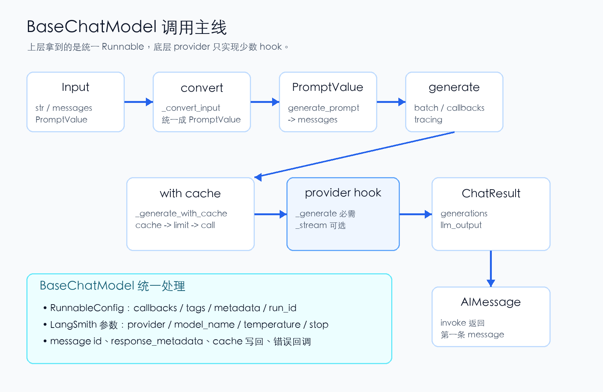
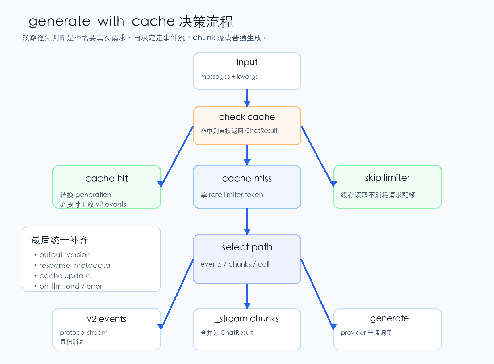

# LangChain源码解析07：BaseChatModel如何统一模型调用

第七篇进入模型调用核心：BaseChatModel 怎样把 invoke、generate、stream、cache、rate limiter、callback/tracing 和 provider 差异收束成一条稳定协议。

第 6 篇我们把 Prompt 和 OutputParser 拆开看了一遍：Prompt 负责把业务输入变成 `PromptValue`，Parser 负责把模型输出收束成字符串、JSON、Pydantic 对象或 tool call。

但中间还缺一块最关键的骨架：模型本身到底是怎么被调用的？

很多人第一次看 LangChain 模型层，会直接去看 `ChatOpenAI`、`ChatAnthropic` 或某个具体 provider。这样当然能看到 API 参数怎么拼，但很容易错过一件事：LangChain 真正想稳定下来的，不是某家模型接口，而是一套聊天模型的统一执行协议。

第 7 篇就进入 `BaseChatModel`。

它不是“帮你发 HTTP 请求”的薄包装，而是把 `invoke`、`generate`、`stream`、cache、rate limiter、callback/tracing、结构化输出和 provider 扩展点都放到同一条生命周期里。



*图 1：BaseChatModel 把模型调用收束成统一生命周期*

## 一、BaseChatModel 的角色：聊天模型的统一执行协议

从源码结构看，`BaseChatModel` 的 public 方法分成两类。

一类是命令式调用：`invoke`、`ainvoke`、`stream`、`astream`、`batch`、`abatch`。这些方法回答的是“现在调用一次模型，怎么拿到结果”。

另一类是声明式包装：`bind_tools`、`with_structured_output`、`with_retry`、`with_fallbacks`、`configurable_fields`。这些方法回答的是“基于当前模型，怎样生成一个带额外行为的新 Runnable”。

这也解释了为什么 `BaseChatModel` 继承的是 `BaseLanguageModel[AIMessage]`，同时又处在 Runnable 体系里：它既是语言模型抽象，也是 LCEL 链路里的一个节点。

理解这一点后，再看具体 provider 会轻松很多。`ChatOpenAI`、`ChatAnthropic` 这些子类不需要重新实现整套 Runnable 生命周期，它们主要负责把 LangChain 的标准消息、参数和工具 schema 翻译成 provider API 能听懂的格式。

## 二、输入归一化：所有入口先变 PromptValue

`BaseChatModel` 接收的输入很宽：可以是字符串，可以是 message 列表，也可以是上一篇讲过的 `PromptValue`。

但真正进入模型调用前，源码会先经过 `_convert_input`：

```python
def _convert_input(model_input):
    if isinstance(model_input, PromptValue):
        return model_input
    if isinstance(model_input, str):
        return StringPromptValue(text=model_input)
    if isinstance(model_input, Sequence):
        return ChatPromptValue(messages=convert_to_messages(model_input))
    raise ValueError(...)
```

这个函数看起来很小，但它把第 4 篇 Message 和第 6 篇 PromptValue 接到了模型层。

字符串会被包装成 `StringPromptValue`；message-like 列表会被转成 `ChatPromptValue`；已经是 `PromptValue` 的输入则直接保留。于是模型入口不用到处判断“我拿到的是字符串还是消息”，后面统一调用 `to_messages()` 即可。

`invoke` 也因此很薄。它先 `ensure_config(config)`，再把单个输入包成列表，调用 `generate_prompt`，最后取 `generations[0][0].message` 作为返回值。

也就是说，`invoke` 不是独立的一套模型请求逻辑。它只是单条调用门面，真正主干在 `generate_prompt` 和 `generate`。

## 三、generate 才是主干：批量、回调和追踪都在这里打开

如果说 `invoke` 是用户最常用的入口，那 `generate` 才是模型层的中枢。

它接收的是 `list[list[BaseMessage]]`，也就是一批消息列表。源码在这里做几件事：

- 计算 invocation params 和 LangSmith metadata。
- 配置 callback manager，把调用声明成一次 chat model run。
- 触发 `on_chat_model_start`，并把 batch size、序列化模型、输入消息和参数交给 tracing。
- 对每组 messages 调用 `_generate_with_cache`。
- 合并 provider 返回的 `llm_output`。
- 在成功时触发 `on_llm_end`，在失败时触发 `on_llm_error`。

这就是 `generate` 的意义：它不是“多调用几次 invoke”，而是 LangChain 把批量调用、可观测性和错误生命周期统一起来的地方。

异步版本 `agenerate` 也保持同样结构，只是会用 `asyncio.gather` 并发调用 `_agenerate_with_cache`。同步和异步的行为边界尽量一致，这一点对上层链路非常重要。

## 四、_generate_with_cache：真正的热路径编排点

`_generate_with_cache` 是这一篇最值得细看的方法。

它的第一步不是请求模型，而是判断 cache。

源码里的 cache 语义很细：

- 如果模型实例传入的是具体 cache 对象，就优先使用这个 cache。
- 如果 `cache=True` 或 `cache=None`，则可以走全局 cache。
- 如果 `cache=False`，明确不查也不写 cache。
- 生成 cache key 时，会把 message id 去掉，避免同一条内容因为运行时 id 不同而错过命中。
- cache 命中后，会把历史 generation 转成 `ChatGeneration`，并在需要时重放 v2 stream events。
- 命中的 `AIMessage.usage_metadata.total_cost` 会被置为 0，避免缓存读取被当成真实模型成本。

注意顺序：rate limiter 是在 cache 之后才执行的。源码注释也说得很直接，cache lookup 不应该被限速，真正的 API 请求才应该消耗速率配额。

所以 `_generate_with_cache` 的实际顺序是：

1. 能不能从 cache 直接拿结果。
2. 如果没命中，再拿 rate limiter token。
3. 如果有 v2 streaming handler，走协议事件流。
4. 如果需要普通 streaming，走 `_stream` 并合并 chunk。
5. 否则走 provider 子类的 `_generate`。
6. 统一补 message id、response metadata、cache 写回。

这条路径把性能、成本、速率限制、流式事件和 provider 调用放在一个方法里处理。它是 `BaseChatModel` 最像“调度器”的地方。



*图 2：_generate_with_cache 同时处理 cache、限速与生成路径选择*

## 五、stream 不是另一条世界线，而是同一协议的流式视角

很多框架会把 streaming 写成完全独立的一套调用逻辑。`BaseChatModel` 的设计不是这样。

`stream` 会先问 `_should_stream`：当前模型是否真的应该走流式？

如果子类没有实现 `_stream`，或者这次调用显式禁用了 streaming，`stream` 会退回到 `invoke`，然后只 yield 一次完整 `AIMessage`。这保证了上层即使写了 `for chunk in model.stream(...)`，也不会因为某个 provider 没有流式实现就直接崩掉。

如果确定要流式，`stream` 会打开和 `generate` 类似的 callback/tracing 生命周期，然后调用 provider 子类的 `_stream`。每个 `ChatGenerationChunk` 都会触发 `on_llm_new_token`，同时被累积起来。流结束后，源码会把 chunks 合并成一个 generation，再触发 `on_llm_end`。

还有一个细节：如果 provider 最后没有显式给出 `chunk_position="last"`，LangChain 会补一个空 chunk 作为结束标记。这种小设计看起来不显眼，但对稳定消费流式结果很有用。

## 六、_should_stream：兼容 provider 差异的开关矩阵

`_should_stream` 不是简单看一个 `stream=True`。

它至少会检查几类条件：

- 子类有没有实现 `_stream` 或 `_astream`。
- `disable_streaming` 是否为 `True`。
- `disable_streaming` 是否为 `"tool_calling"`，并且本次调用传了 tools。
- 调用参数里是否显式 `stream=False`。
- 模型实例上是否设置了 `streaming=True` 或 `streaming=False`。
- callback handler 是否需要 streaming token。

这里最有意思的是 `disable_streaming="tool_calling"`。有些模型在普通文本流式上表现正常，但工具调用流式可能不稳定。LangChain 给了一个中间态：平时可以 stream，一旦本次调用带 tools，就退回非流式。

这不是为了让 API 变复杂，而是为了让“可替换模型”这件事更现实。不同 provider 对 streaming、tools、结构化输出的支持程度不一样，`BaseChatModel` 用一组开关把差异兜住。

## 七、provider 子类真正要实现什么

`BaseChatModel` 的源码文档里列得很清楚：自定义聊天模型时，真正必需的是 `_generate` 和 `_llm_type`。

`_generate` 负责拿标准 messages 和参数去调用底层模型，再返回 `ChatResult`。`_llm_type` 用来标识模型类型，主要服务日志和序列化。

其他都是可选增强：

- `_stream`：支持同步流式。
- `_agenerate`：支持原生异步调用；否则会默认跑到 executor。
- `_astream`：支持异步流式；否则会桥接同步 `_stream`。
- `_identifying_params`：描述模型参数，参与 tracing 和 cache key。
- `_get_ls_params`：给 LangSmith 更稳定的 provider、model name、temperature、max tokens 等元数据。
- `_combine_llm_outputs`：批量调用时合并 provider 额外输出。

这层分工非常重要。LangChain 不要求每个 provider 子类都重新处理 cache、callback、message id、metadata、stream fallback 和结构化输出包装。子类只要把“怎么调用这家模型”做好，公共生命周期由基类接管。

## 八、bind_tools 和 with_structured_output：模型层重新接回 Tool 与 Parser

第 5 篇讲过 Tool，第 6 篇讲过 Parser。到了 `BaseChatModel`，这两条线重新合在一起。

`bind_tools` 是 provider 子类需要实现的能力，因为不同模型 API 的 tools 格式不同。OpenAI、Anthropic 等集成包会把 LangChain 的工具 schema 翻译成各自 provider 需要的参数。

`with_structured_output` 的默认实现则更能体现 LangChain 的复用思路。

它会先检查当前模型有没有实现 `bind_tools`。如果没有，就说明这个模型无法通过工具调用协议承载结构化输出。若支持，它会把传入的 schema 作为一个 tool 绑定到模型上，并强制 `tool_choice="any"`。

之后，输出端再接 parser：

- 如果 schema 是 Pydantic class，就用 `PydanticToolsParser` 校验成对象。
- 如果是 dict、TypedDict 或 OpenAI tool schema，就用 `JsonOutputKeyToolsParser` 取出目标字段。
- 如果 `include_raw=True`，最终会返回 `raw`、`parsed`、`parsing_error` 三个字段。

这说明结构化输出不是孤立功能。它底层复用了工具调用协议，也复用了 output parser。模型层只负责把 schema 绑定给 provider，解析层负责把模型返回的 tool call 收束成业务对象。

## 九、第七篇的结论

`BaseChatModel` 的核心价值，不是让调用模型少写几行代码，而是把“调用模型”这件事拆成一条可组合、可追踪、可缓存、可流式、可替换的协议。

向上，它对 Runnable 暴露 `invoke`、`stream`、`batch` 和声明式包装；向下，它只要求 provider 子类实现 `_generate` 这类窄接口；中间，它统一处理 cache、rate limiter、callback、LangSmith metadata、message id、response metadata、stream fallback 和结构化输出。

所以当你写：

```python
chain = prompt | model | parser
```

这里的 `model` 不是一个简单函数。它是 LangChain 运行时里最重的一层协议适配器：左边接 PromptValue 和 Message，右边接 provider API，外面还挂着 RunnableConfig、tracing、cache、流式事件和结构化输出。

理解这一层后，再看不同 provider 的集成包，就不会被具体 API 参数带着走。你会先问：这个 provider 子类实现了哪些 hook？它如何实现 `bind_tools`？它如何上报 `ls_model_name`？它的 streaming 是原生实现，还是走基类 fallback？

这些问题，才是读 LangChain 模型层源码的主线。

## 系列位置

当前文章：第 7 篇，拆 `BaseChatModel` 如何统一模型调用生命周期。

系列链接：
第 1 篇：[LangChain源码解析01：先看懂Agent工程骨架](https://mp.weixin.qq.com/s/tPhQNpcwcDNPmNTfealwhA)
第 2 篇：[LangChain源码解析02：Runnable把一切串起来](https://mp.weixin.qq.com/s/cOYJN_7pZ3FZbVRdAD95ww)
第 3 篇：[LangChain源码解析03：RunnableConfig如何追踪到底](https://mp.weixin.qq.com/s/u7WqvJhNkjUW-LCzWNyhLQ)
第 4 篇：[LangChain源码解析04：Message不只是字符串](https://mp.weixin.qq.com/s/IoS6e0hHx9uuhegH6WvAxA)
第 5 篇：[LangChain源码解析05：Tool如何从函数变成契约](https://mp.weixin.qq.com/s/RdojltI3OiONkSsG0rTTaA)
第 6 篇：[LangChain源码解析06：Prompt和Parser守住两端](https://mp.weixin.qq.com/s/qKk6xfZRkSCpBeQlEHBrAA)
第 7 篇：`LangChain源码解析07：BaseChatModel如何统一模型调用`，当前篇。

源码参考：
GitHub: https://github.com/langchain-ai/langchain

当模型调用协议已经被 `BaseChatModel` 统一之后，LangChain 又是怎样通过 `init_chat_model`，把 provider 推断、集成包加载和可配置模型串成一个入口的？

---

## 源码阅读标记

本稿主要对应以下实现点：

- `libs/core/langchain_core/language_models/chat_models.py`
  - `BaseChatModel` 类文档中的 imperative/declarative 方法表。
  - `_convert_input`、`invoke`、`ainvoke`。
  - `_should_stream`、`stream`、`astream`。
  - `generate`、`agenerate`、`generate_prompt`、`agenerate_prompt`。
  - `_generate_with_cache`、`_agenerate_with_cache`。
  - `_convert_cached_generations`、`_replay_v2_events_for_cache_hit`。
  - `_get_ls_params`、`_get_ls_params_with_defaults`。
  - `_generate`、`_stream`、`_agenerate`、`_astream`、`bind_tools`、`with_structured_output`。
- 相关单元测试：
  - `libs/core/tests/unit_tests/language_models/chat_models/test_cache.py`
  - `libs/core/tests/unit_tests/language_models/chat_models/test_base.py`
  - `libs/core/tests/unit_tests/language_models/chat_models/test_rate_limiting.py`

## 维护备注

- 微信版正文刻意不列源码文件路径，避免读者被细节打断。
- 两张图已经渲染为 PNG，并在 HTML 中以内嵌 base64 方式引用。
- 公众号标题需在编辑器里确认计数不超过 64/64。

