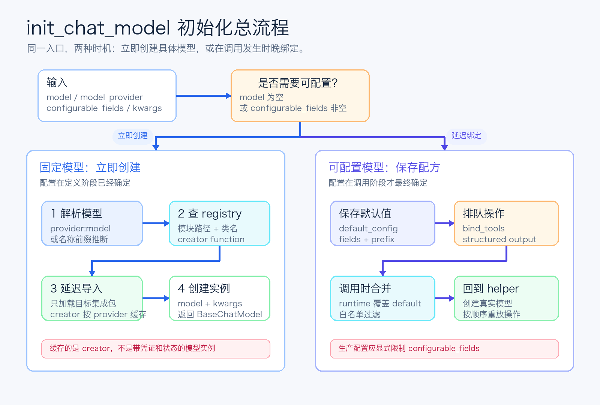
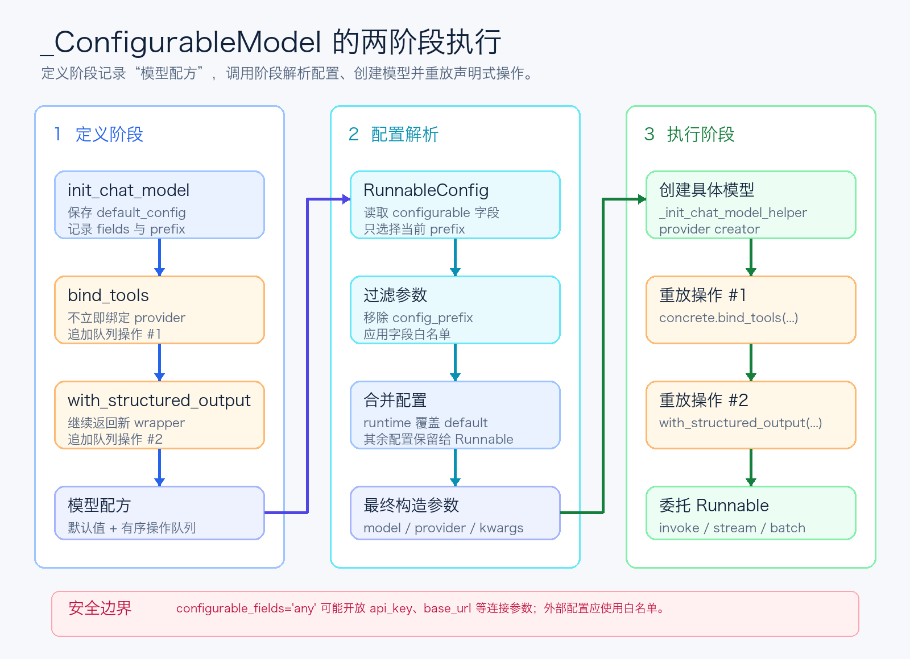

# LangChain源码解析08：init_chat_model如何动态切换模型

第八篇继续沿着模型层往下走：`BaseChatModel` 已经统一了调用协议，但一个具体的聊天模型实例，究竟是怎样被创建出来的？

第 7 篇里，我们拆开了 `invoke`、`generate`、`stream`、cache、rate limiter 和 callback/tracing，看到 LangChain 如何把不同 provider 的调用过程收束到同一套生命周期里。

不过在真正调用之前，还有一个更靠近应用入口的问题：

```python
model = init_chat_model("openai:model-name")
```

这一行为什么既能返回已经就绪的模型，也能返回一个等到运行时再决定 provider 的“模型壳”？模型名前缀如何解析？集成包为什么不需要一次性全部导入？`bind_tools` 又如何在真实模型尚未出现时继续工作？

这些问题都集中在 `init_chat_model` 和 `_ConfigurableModel` 里。



*图 1：init_chat_model 在固定模型与可配置模型之间分流*

## 一、它不是“万能模型类”，而是模型创建路由器

第一次看到 `init_chat_model`，很容易把它理解成一个统一封装：不管 OpenAI、Anthropic 还是其他 provider，都由这个函数替你创建对象。

这只说对了一半。

从源码结构看，它真正统一的不是各家模型的构造参数，而是“如何找到正确的模型实现”。具体 provider 仍然拥有自己的类、依赖和参数校验；`init_chat_model` 只负责完成几件事：

- 判断这次要立即创建模型，还是返回可配置代理。
- 从模型字符串中解析或推断 provider。
- 定位 provider 对应的集成包和模型类。
- 延迟导入集成包，并调用对应的构造方式。
- 在可配置模式下，把运行时配置重新送回同一条创建链路。

因此，它更像一个路由器，而不是把所有 provider 逻辑揉在一起的超级工厂。

这个边界很重要。LangChain 可以扩展 provider 列表，却不用让主包直接依赖每一家 SDK；集成包也可以独立演进，只要最终产出一个遵守 `BaseChatModel` 协议的对象。

## 二、同一个入口，实际上有两种返回形态

`init_chat_model` 最关键的分岔，由 `model` 和 `configurable_fields` 共同决定。

固定模型模式很直接：传入模型名，并且没有声明任何运行时可配置字段，函数会立刻调用 `_init_chat_model_helper`，返回具体的 `BaseChatModel`。

```python
model = init_chat_model(
    "openai:model-name",
    temperature=0,
)
```

此时 provider、模型名和初始化参数都已经确定，返回值可以立即调用。

可配置模型模式则不同：只要设置了 `configurable_fields`，或者干脆不传 `model`，返回值就会变成 `_ConfigurableModel`。

```python
model = init_chat_model(
    configurable_fields=("model", "model_provider", "temperature"),
    config_prefix="chat",
)
```

这里并没有创建任何 provider 模型。函数只是保存默认配置、允许变化的字段和配置前缀，等 `invoke`、`stream` 或 `batch` 真正发生时再实例化。

还有一个很贴心的默认行为：如果 `model` 为空，同时也没有显式传 `configurable_fields`，源码会自动把可配置字段设为 `("model", "model_provider")`。所以 `init_chat_model()` 本身就是一个“运行时再选模型”的入口。

反过来，如果设置了 `config_prefix`，却没有任何可配置字段，源码会发出 warning。因为一个没有可配置字段的前缀没有实际意义。

## 三、provider 解析：显式前缀优先，名称推断兜底

真正创建模型前，`_parse_model` 会先把模型名和 provider 拆开。

推荐写法是把 provider 放在模型名前面：

```text
openai:model-name
anthropic:model-name
google_genai:model-name
```

当冒号前的部分命中内置 provider registry 时，源码会取出 provider，并把剩余部分作为真正的模型名。这样做最稳定，因为模型属于哪家服务是显式信息。

如果没有 provider 前缀，也没有单独传 `model_provider`，LangChain 才会进入 `_attempt_infer_model_provider`。

它会根据模型名开头做 best-effort 推断，例如：

- `gpt-`、`o1`、`o3` 会推断为 OpenAI。
- `claude` 会推断为 Anthropic。
- `amazon.`、`anthropic.`、`meta.` 会推断为 Bedrock。
- `mistral`、`mixtral` 会推断为 Mistral AI。
- `deepseek`、`grok`、`sonar`、`solar` 也各有对应映射。

这个设计方便，但它不是一个可靠的全球模型目录。模型命名规则可能重叠，也可能随 provider 演进。源码对 `gemini` 就专门给出了迁移提醒：当前推断结果存在版本变化计划，想锁定行为应明确传 provider。

所以这里的工程建议很清楚：示例和临时脚本可以享受推断的便利，长期运行的生产配置更适合使用 `provider:model`，把路由选择写进配置本身。

如果最终仍然无法得到 provider，源码不会静默选择一个默认值，而是抛出异常，并列出受支持的 provider。这种“无法判断就尽早失败”的行为，比请求发出去后才暴露配置错误更容易排查。

## 四、provider registry：保存的是导入配方，不是模型对象

内置 provider registry 的每一项都包含三部分：

1. Python 模块路径。
2. 聊天模型类名。
3. 如何创建这个类的 creator function。

以常见 provider 为例，可以把它简化理解为：

```python
{
    "openai": ("langchain_openai", "ChatOpenAI", creator),
    "anthropic": ("langchain_anthropic", "ChatAnthropic", creator),
    "ollama": ("langchain_ollama", "ChatOllama", creator),
}
```

为什么还需要第三个 creator，而不是统一写成 `cls(model=model, **kwargs)`？因为 provider 的构造约定并不完全一致。有的类使用 `model`，有的使用 `model_id`，有的需要调用 `from_model_id`。registry 把这点差异压缩成一个小型创建适配器，主流程不必堆积 provider 分支。

`_get_chat_model_creator` 随后执行动态导入：先导入目标模块，再按类名取得模型类，最后把类和 creator 绑定成真正的工厂函数。

这里有两个容易混淆的“懒”行为。

第一，集成包是按 provider 延迟导入的。使用 OpenAI 不会顺便加载 Anthropic、Ollama 和其他依赖。

第二，creator 会被 `lru_cache` 缓存，避免同一个 provider 反复执行模块查找和类绑定；但具体模型实例并没有因此被全局缓存。可配置模型每次解析调用配置时，仍会按当次参数创建对应实例。

也就是说，缓存的是“怎么创建”，不是“已经创建好的模型”。这避免了把 API key、base URL、callback 或其他实例状态错误地跨调用共享。

如果集成包没有安装，导入层会给出更明确的依赖提示；如果 provider 不在 registry 中，则会直接报告不支持。错误在模型创建边界被集中处理，上层不需要理解每个包的导入路径。

## 五、_ConfigurableModel：它是一张延迟执行的模型配方

`_ConfigurableModel` 继承自 `Runnable`，但它本身不是 `BaseChatModel` 的具体实现。

更准确地说，它保存了一张模型配方：

- `_default_config`：默认模型名、provider 和初始化参数。
- `_configurable_fields`：允许运行时覆盖的字段白名单，或者字符串 `"any"`。
- `_config_prefix`：从 `RunnableConfig.configurable` 中识别属于自己的键。
- `_queued_declarative_operations`：真实模型创建后需要依次重放的声明式操作。

调用 `invoke` 时，它不会自己生成消息，而是执行下面这条链路：

```python
params = default_config + runtime_model_params
model = _init_chat_model_helper(**params)
model = replay_declarative_operations(model)
return model.invoke(input, config=config)
```

运行时参数覆盖默认参数，然后重新进入固定模型使用的 `_init_chat_model_helper`。这意味着固定模式和可配置模式没有两套 provider 创建逻辑：差别只在于参数何时确定。

这也是 `init_chat_model` 设计里最漂亮的一点。动态切换能力没有侵入每个 provider 类，而是被放在 provider 实例之外，用一个 Runnable 代理完成晚绑定。



*图 2：_ConfigurableModel 在调用时合并配置并重放声明式操作*

## 六、bind_tools 为什么能在模型尚未创建时调用

可配置模型有一个现实难题：`bind_tools` 和 `with_structured_output` 都是 provider 相关操作，但声明链路时可能还不知道最终会使用哪个 provider。

LangChain 的处理方式不是提前猜，而是排队。

当 `_ConfigurableModel` 收到这两个声明式方法时，`__getattr__` 会记录方法名、位置参数和关键字参数，并返回一个新的 `_ConfigurableModel`。原对象的队列不会被原地修改，因此下面这种写法仍然保持 Runnable 的声明式风格：

```python
base_model = init_chat_model()
tool_model = base_model.bind_tools(tools)
structured_model = tool_model.with_structured_output(OutputSchema)
```

直到真正调用时，`_model` 才会先创建具体 provider 模型，再按原顺序执行：

```text
concrete_model
  -> bind_tools(tools)
  -> with_structured_output(OutputSchema)
```

顺序不能丢，因为声明式包装的结果通常仍是一个新的 Runnable，后一个操作必须作用在前一个操作的返回值上。

这套队列机制解决的是“定义时间”和“执行时间”之间的矛盾：应用可以先把链路结构写好，provider 则延迟到请求到来时决定。

不过它也刻意只支持少数声明式方法。像 `get_num_tokens` 这种需要具体模型能力的方法，在既没有默认模型、也没有运行时配置时不能凭空执行，源码会抛出 `AttributeError`。延迟绑定并不意味着代理可以伪装成所有 provider 的完整能力集合。

## 七、config_prefix：让同一条链路里的多个模型互不串线

运行时配置来自 `RunnableConfig` 的 `configurable` 字段。`_model_params` 会做三步过滤：

1. 只选择以当前 `config_prefix` 开头的键。
2. 去掉前缀，恢复成模型构造参数名。
3. 如果可配置字段不是 `"any"`，再按白名单过滤一次。

例如：

```python
model = init_chat_model(
    "openai:model-a",
    configurable_fields=("model", "temperature"),
    config_prefix="chat",
)

response = model.invoke(
    "请总结这段内容",
    config={
        "configurable": {
            "chat_model": "anthropic:model-b",
            "chat_temperature": 0,
        }
    },
)
```

初始化时，`chat` 会被规范成 `chat_`。调用时，`chat_model` 和 `chat_temperature` 被取出并去掉前缀，随后覆盖默认配置。

前缀的价值在多模型链路里最明显。你可以同时配置 `planner_model`、`writer_model`、`reviewer_model`，而不会让一个节点的参数误伤另一个节点。

`with_config` 还会进一步区分两类配置：属于模型构造的字段会合并进新的默认配置；tags、callbacks、metadata 等其余 Runnable 配置，则作为 `with_config` 操作排进队列，最终施加到真实模型上。

所以运行时模型参数和 Runnable 运行元数据虽然都从 config 进入，却不会被混成同一类东西。

## 八、多配置 batch：为什么不能总交给同一个底层模型

`_ConfigurableModel` 对 `invoke`、`stream`、`transform` 等方法的处理很直接：解析当前 config，创建实际模型，然后把调用委托下去。

`batch` 稍微特殊。

如果所有输入共享一个 config，或者只提供了一个 config，代理可以只解析出一个底层模型，并直接复用该模型自己的 batch 实现。这通常能利用 provider 原生批处理或基类优化。

如果每个输入都有不同 config，情况就变了：第一个输入可能走 OpenAI，第二个输入可能走 Anthropic，第三个输入甚至可能使用不同 base URL。此时不可能把整批请求交给一个底层模型。

源码会退回 `Runnable.batch` 的通用并行语义，让每个输入分别经过 `invoke`，各自解析自己的模型配置。

这个分支看起来只是性能优化，背后却表达了一个重要约束：批处理能否下推，取决于这一批输入是否共享同一个执行对象。

## 九、最容易忽略的安全边界：不要随手开放 any

`configurable_fields="any"` 使用起来最省事，但源码文档专门为它写了安全警告。

原因很直接：模型构造参数里不只有 `temperature` 和 `max_tokens`，还可能包括 `api_key`、`base_url`、代理地址以及其他连接配置。如果运行时 config 来自不可信输入，开放所有字段可能让请求被重定向到另一套服务，甚至使用错误的凭证边界。

因此，面向外部请求的应用更适合显式声明白名单：

```python
configurable_fields=("model", "model_provider", "temperature")
```

`config_prefix` 负责隔离“这个字段属于哪个模型”，`configurable_fields` 负责限制“这个模型允许改哪些字段”。两者解决的是不同问题，不能互相替代。

这也提醒我们：动态配置不只是便利功能，它本质上是在运行时开放对象构造权。开放到什么程度，应该由应用边界决定。

## 十、第八篇的结论

`init_chat_model` 的价值，不是把几十家 provider 的所有参数伪装成完全相同，而是把模型发现和创建过程收束成一条稳定路径。

固定模型模式下，它解析 provider、动态导入集成包，并立即返回 `BaseChatModel`；可配置模式下，它先返回 `_ConfigurableModel`，等调用发生时再合并默认配置与运行时配置，创建真实模型，重放 `bind_tools` 和 `with_structured_output`，最后把 Runnable 调用委托下去。

这套设计可以概括成三个工程判断：

- 用 provider registry 隔离“去哪里找到实现”。
- 用延迟导入隔离“什么时候加载依赖”。
- 用 Runnable 代理隔离“什么时候决定具体模型”。

于是模型切换不需要改写 Prompt、Tool 或 Parser，也不需要让每个 provider 自己理解运行时路由。上层链路依赖的是稳定协议，底层实例则可以按配置晚绑定。

但这种灵活性并不是免费的：模型实例会按调用配置创建，声明式操作必须排队重放，多配置 batch 不能强行下推，开放任意构造字段还会扩大安全边界。

真正理解这些约束后，`init_chat_model` 就不再只是一个便捷函数。它是 LangChain 模型抽象与 provider 生态之间的装配层，也是 `RunnableConfig` 从“运行参数”走向“运行时依赖注入”的一个典型例子。

## 系列链接

第 1 篇：[LangChain源码解析01：先看懂Agent工程骨架](https://mp.weixin.qq.com/s/tPhQNpcwcDNPmNTfealwhA)

第 2 篇：[LangChain源码解析02：Runnable把一切串起来](https://mp.weixin.qq.com/s/cOYJN_7pZ3FZbVRdAD95ww)

第 3 篇：[LangChain源码解析03：RunnableConfig如何追踪到底](https://mp.weixin.qq.com/s/u7WqvJhNkjUW-LCzWNyhLQ)

第 4 篇：[LangChain源码解析04：Message不只是字符串](https://mp.weixin.qq.com/s/IoS6e0hHx9uuhegH6WvAxA)

第 5 篇：[LangChain源码解析05：Tool如何从函数变成契约](https://mp.weixin.qq.com/s/RdojltI3OiONkSsG0rTTaA)

第 6 篇：[LangChain源码解析06：Prompt和Parser守住两端](https://mp.weixin.qq.com/s/qKk6xfZRkSCpBeQlEHBrAA)

第 7 篇：[LangChain源码解析07：BaseChatModel如何统一模型调用](https://mp.weixin.qq.com/s/hHbN-NPmvdDAPLjsscdWCA)

源码参考：
GitHub: https://github.com/langchain-ai/langchain

当模型、工具、Prompt 和运行时配置都已经具备统一协议后，LangChain 是怎样把一次“模型调用”组织成可以循环、分支和结束的 Agent 状态图的？
