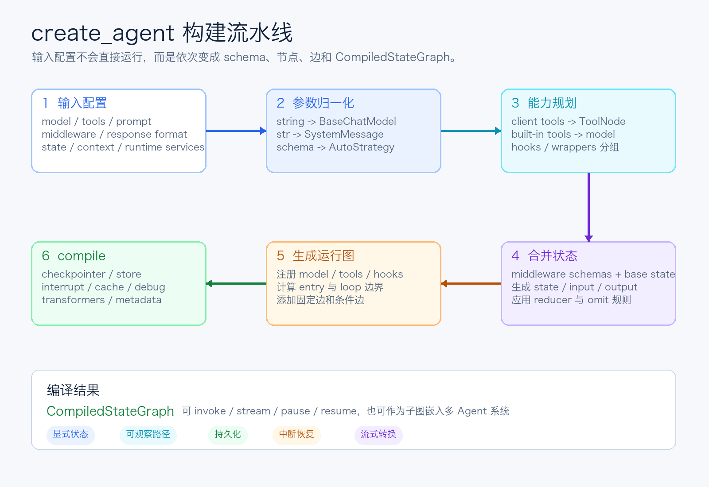
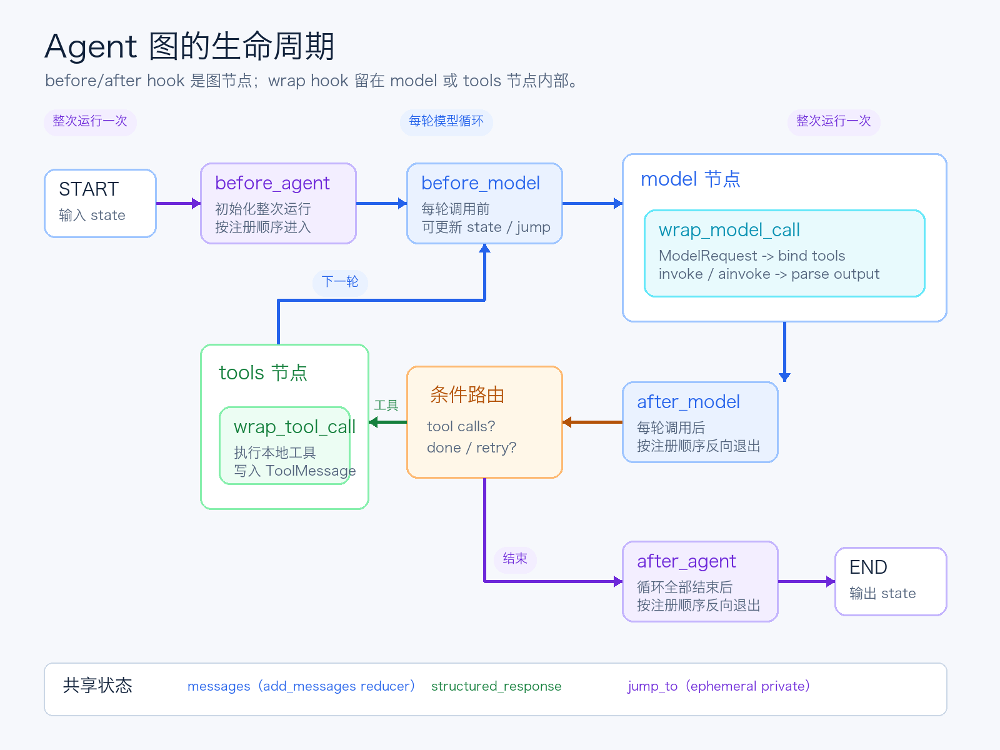

# LangChain源码解析09：create_agent如何编译Agent运行图

第九篇进入 LangChain v1 最关键的应用入口：`create_agent`。

第 8 篇拆完 `init_chat_model` 后，我们已经知道一个模型字符串如何变成具体的 `BaseChatModel`，也知道模型可以在运行时晚绑定。但“能调用模型”还不等于“拥有一个 Agent”。

Agent 至少还要解决这些问题：

- 模型什么时候调用工具？
- 工具结果如何回到消息状态？
- middleware 应该插在循环的哪个位置？
- 结构化输出什么时候算完成？
- 状态如何持久化、暂停、恢复和流式输出？

`create_agent` 的答案不是再造一个巨型执行器，而是把这些规则编译成一张 `StateGraph`。

这也是阅读源码时最需要先建立的判断：`create_agent` 不是“立即运行 Agent”的函数，而是“生成 Agent 运行时”的工厂。



*图 1：create_agent 把输入配置编译成可运行状态图*

## 一、返回值不是 Agent 类，而是 CompiledStateGraph

从函数签名看，`create_agent` 接收模型、工具、系统提示词、middleware、结构化输出、状态 schema、checkpointer、store、中断点、cache 和 transformers，最后返回 `CompiledStateGraph`。

这个返回类型决定了整个实现的气质。

如果返回的是传统 `AgentExecutor`，源码通常会围绕一个 `while` 循环组织：调用模型，检查工具，执行工具，再调用模型。

但 `CompiledStateGraph` 要求 `create_agent` 在构建阶段回答三类问题：

1. 图里有哪些节点。
2. 节点之间有哪些固定边和条件边。
3. 哪些状态字段、运行时服务和流式转换器需要交给图执行引擎。

因此，源码前半段主要在“收集与归一化”，后半段才开始 `add_node`、`add_edge` 和 `compile`。

最终得到的不是一段只会从头跑到尾的函数，而是一张可以暂停、恢复、持久化、观察和嵌套的运行图。

## 二、第一阶段：先把宽松输入收束成内部对象

`create_agent` 的参数对使用者很友好，但图构建不适合一直处理多种输入形态，所以入口先做一轮归一化。

### 1. 模型归一化

如果 `model` 是字符串，就交给上一篇讲过的 `init_chat_model`；如果已经是 `BaseChatModel` 实例，则直接使用。

```python
if isinstance(model, str):
    model = init_chat_model(model)
```

从这里开始，后面的模型节点只面对统一模型协议，不再关心 provider 字符串怎样解析。

### 2. 系统提示词归一化

字符串形式的 `system_prompt` 会变成 `SystemMessage`。但它不会直接写进 Agent 的 `messages` 状态，而是在每次真正调用模型前临时放到消息列表最前面。

这意味着系统提示词属于模型请求配置，不是对话历史本身。状态里仍然保存用户、AI 和工具之间实际发生的消息。

### 3. 工具归一化

`tools=None` 会变成空列表。之后工具会被拆成两类：

- `dict` 形式的 provider built-in tools。
- callable 或 `BaseTool` 形式的 client-side tools。

两者都会暴露给模型，但只有需要客户端实际执行的工具才进入 `ToolNode`。

### 4. response_format 归一化

用户可以显式传 `ToolStrategy` 或 `ProviderStrategy`，也可以只传 Pydantic、TypedDict 或 JSON Schema。

原始 schema 会先包装成 `AutoStrategy`，保留“运行时根据模型能力自动选择”的意图。与此同时，构建阶段还会临时按 `ToolStrategy` 生成结构化输出工具，提前确定工具名和解析绑定。

这看起来绕了一步，实际是在同时满足两个约束：图构建时必须知道可能出现哪些工具，模型调用时又要保留 provider-native structured output 的选择空间。

## 三、ToolNode 不是所有工具的容器

工具处理是 `create_agent` 里第一个容易误读的地方。

源码会先收集三种来源：

- 用户传入的普通工具。
- 用户传入的 provider built-in tool 描述。
- middleware 自己声明的工具。

普通工具和 middleware 工具需要在当前进程执行，因此进入 `ToolNode`。callable 也会在这里被转换成标准 `BaseTool`，后续模型绑定使用的是转换后的工具对象。

provider built-in tools 则不同。它们通常描述搜索、代码执行或 provider 托管能力，真正执行发生在模型服务端，所以只需要绑定给模型，不需要进入客户端 `ToolNode`。

源码还处理了一个更动态的场景：即使没有静态 client-side tools，只要 middleware 实现了 `wrap_tool_call`，也会创建 `ToolNode`。因为 middleware 可能在运行时注册或接管工具执行。

因此，是否存在 `tools` 节点，不只取决于 `tools` 参数是否非空，还取决于 Agent 是否具备客户端工具执行路径。

这层区分让 provider 工具和客户端工具可以出现在同一份 `ModelRequest.tools` 中，却不会被错误地交给同一个执行器。

## 四、middleware 有两种形态：图节点与调用包装器

很多人看到 middleware，会以为每一个 middleware 都会在图里增加一个节点。源码并不是这样设计的。

middleware hook 实际分成两类。

第一类是生命周期节点：

- `before_agent`
- `before_model`
- `after_model`
- `after_agent`

只要 middleware 覆盖了对应的同步或异步方法，`create_agent` 就会把它注册成一个 `RunnableCallable` 节点，例如：

```text
Guard.before_model
Audit.after_model
```

第二类是调用包装器：

- `wrap_model_call` / `awrap_model_call`
- `wrap_tool_call` / `awrap_tool_call`

它们不会成为独立图节点，而是被组合成嵌套 handler，包在 model 节点或 ToolNode 的真实调用外面。

可以把两者的区别理解为：生命周期 hook 改变图的结构，wrapper 改变某个节点内部的一次调用。

多个 wrapper 会按 middleware 注册顺序组合，排在前面的 middleware 成为更外层。这样它既可以在调用前修改 `ModelRequest`，也可以在调用后检查 `ModelResponse`，还可以选择重试或短路底层 handler。

源码同时要求 middleware 的 `name` 不能重复。因为生命周期节点名由 `middleware.name + hook_name` 生成，重名会让图节点发生碰撞。

## 五、AgentState：整张图真正共享的主干

模型和工具只是节点，真正把所有节点连接成一个 Agent 的是状态。

默认 `AgentState` 只有三个核心字段：

- `messages`：使用 `add_messages` reducer 累积 Human、AI 和 Tool 消息。
- `jump_to`：供 middleware 临时改变路由，属于 ephemeral private state。
- `structured_response`：结构化结果，只出现在输出侧，不要求调用者输入。

这里最关键的是 `messages` 上的 reducer。model 节点返回新的 `AIMessage`，tools 节点返回 `ToolMessage`，它们都不是手动修改原列表，而是提交状态更新，由 LangGraph 按 reducer 合并。

`create_agent` 还允许 middleware 和调用者扩展状态。源码会依次收集每个 middleware 的 `state_schema`，最后再放入显式 `state_schema` 或默认 `AgentState`。

合并规则是“后声明覆盖前声明”：后面的 middleware 可以覆盖前面的同名字段，而调用者显式传入的 base state 最后处理，因此拥有最高优先级。

随后 `_resolve_schemas` 会一次生成三份 schema：

- 内部完整状态 schema。
- 调用者允许传入的 input schema。
- Agent 最终返回的 output schema。

`OmitFromSchema` 注解决定某些字段是否只在图内部存在。例如 `jump_to` 不应该成为公共输入输出，`structured_response` 则不应该要求用户在调用前提供。

所以 state schema 不只是类型提示，它同时定义了通道、reducer、输入边界和输出边界。

## 六、model 节点不是简单的 model.invoke

状态图创建之后，`create_agent` 会定义同步和异步两套 model handler，再用一个 `RunnableCallable` 注册成统一的 `model` 节点。

每轮进入 model 节点时，源码先构造 `ModelRequest`：

```text
model
tools
system_message
response_format
messages
state
runtime
```

这是 middleware 能动态改模型、工具、提示词和结构化输出策略的关键。wrapper 接到的不是几个零散参数，而是一份完整、可复制覆盖的请求对象。

如果存在 `wrap_model_call`，请求会先穿过组合后的 middleware stack；最内层才进入 `_execute_model_sync` 或 `_execute_model_async`。

真正调用模型前，`_get_bound_model` 还会完成一轮运行时装配：

1. 校验 middleware 动态加入的 client-side tool 是否有执行路径。
2. 根据模型 profile 选择 ProviderStrategy 或 ToolStrategy。
3. 把普通工具、provider built-in tools 和结构化输出工具合并。
4. 调用 `bind_tools` 或 `bind` 得到本轮真正使用的 Runnable。

然后系统消息被放到当前消息列表前面，执行 `invoke` 或 `ainvoke`。

模型结果也不会直接原样写回状态。`_handle_model_output` 会解析 provider structured output，或把结构化工具调用转换成 `structured_response` 和对应 `ToolMessage`。最后 `_build_commands` 再把消息、结构化结果以及 middleware 附加的 `Command` 统一变成图状态更新。

因此，model 节点更像一个“小型请求管线”：组装请求、执行 middleware、绑定工具、调用模型、解析输出，最后提交状态变化。

## 七、节点注册：同步与异步被放进同一张图

核心 model 节点通过下面的方式注册：

```python
graph.add_node(
    "model",
    RunnableCallable(model_node, amodel_node, trace=False),
)
```

`RunnableCallable` 同时持有同步和异步实现。图结构只有一个 `model` 节点，运行时根据调用方式选择正确路径，不需要为 sync 和 async 复制两张图。

如果存在 client-side tool 执行路径，再增加 `tools` 节点。

接下来遍历 middleware，为真正被覆盖的生命周期 hook 添加节点。没有实现某个 hook，就不会产生空节点；wrapper 也不会污染图结构。

这一点非常工程化：图上只保留对状态和路由有独立意义的阶段，某次调用内部的横切逻辑则留在 wrapper stack 中。

## 八、四个生命周期位置，执行频率并不相同

middleware 节点注册完成后，源码会计算四个关键位置：

- `entry_node`：整次 Agent 运行的入口。
- `loop_entry_node`：每轮模型循环的入口。
- `loop_exit_node`：每轮模型调用后的出口。
- `exit_node`：整次 Agent 运行结束前的出口。

这四个位置解决了一个常见混淆：`before_agent` 和 `before_model` 都在模型之前，但前者只运行一次，后者每轮都运行。

同样，`after_model` 每轮模型调用后都会执行，而 `after_agent` 只在整个循环结束时执行一次。



*图 2：create_agent 编译后的 middleware 生命周期与 Agent 循环*

middleware 的顺序也不是简单从前到后贯穿到底。

假设注册顺序是 `A, B`：

```text
START
  -> A.before_agent
  -> B.before_agent
  -> A.before_model
  -> B.before_model
  -> model
  -> B.after_model
  -> A.after_model
  -> ...
  -> B.after_agent
  -> A.after_agent
  -> END
```

前置 hook 按注册顺序进入，后置 hook 反向退出。这和嵌套调用栈的直觉一致：先进入 A，再进入 B；离开时先退出 B，再退出 A。

## 九、边不是固定模板，而是按能力剪裁

节点有了之后，`create_agent` 才开始连边。

最小 Agent 没有工具、结构化输出和 after_model middleware，图可以简单到：

```text
START -> model -> END
```

有 client-side tools 时，model 的出口会变成条件边：需要执行的 tool call 进入 `tools`，没有 tool call 则结束。工具执行完成后，通常回到 `loop_entry_node`，开始下一轮模型调用。

如果工具声明 `return_direct=True`，或者结构化输出已经完成，tools 也可能直接走向退出节点。

如果没有普通工具，但 ToolStrategy 结构化输出需要重试，图甚至会出现 model 到 model 的条件循环。

middleware 声明了 `can_jump_to` 时，对应节点也会获得条件边，可以跳到 model、tools 或 end。

这些边并不是为了把图画复杂，而是让“哪些路径可能发生”在编译时显式可见。具体路由函数如何判断 pending tool calls、人工注入的 ToolMessage、structured_response 和 return_direct，会在后续继续展开。

## 十、compile 才把图变成真正的运行时

最后一步是 `graph.compile(...)`。

前面的代码定义了状态、节点和边，compile 则把运行时能力注入这张图：

- `checkpointer`：保存单个 thread 的状态，用于对话记忆、暂停和恢复。
- `store`：保存跨 thread 的长期数据。
- `interrupt_before` / `interrupt_after`：在指定节点前后暂停。
- `cache`：缓存图节点执行结果。
- `debug`：输出图执行细节。
- `name`：给子图和多 Agent 编排提供稳定身份。
- `transformers`：转换工具调用、子 Agent 和自定义流式事件。

默认 transformer 顺序也经过设计：先处理 ToolCall，再处理 Subagent，然后接 middleware 提供的 transformer，最后才是调用者显式传入的 transformer。

编译完成后，源码还通过 `with_config` 设置较高的 recursion limit，并写入 LangChain 集成与 Agent 名称元数据。

这说明 `create_agent` 的终点不是“构造几个 Python 对象”，而是得到一个已经具备状态通道、调度规则、持久化接口、中断机制和流式转换能力的 Runnable 图。

## 十一、第九篇的结论

`create_agent` 的核心价值，不是替开发者隐藏一个 while 循环，而是把 Agent 拆成可以被 LangGraph 调度的工程结构。

它先把模型、提示词、工具和 response format 收束成内部对象；再区分 provider 工具与 client-side 工具、生命周期 hook 与调用 wrapper；随后合并状态 schema，构造 model 请求管线，注册 model、tools 和 middleware 节点；最后按实际能力连接边，并通过 compile 注入持久化、中断、缓存和流式能力。

整条链路可以概括成一句话：

```text
create_agent = 配置归一化 + 运行节点装配 + 状态图编译
```

这套设计带来三个重要结果。

第一，Agent 循环从隐藏控制流变成显式图结构，路径可以观察、测试和中断。

第二，扩展点被分配到正确层级：改变生命周期的逻辑进入图节点，包裹一次调用的逻辑留在 wrapper，新增状态的逻辑进入 schema。

第三，模型和工具只负责自己的窄职责，checkpointer、store、streaming 和 human-in-the-loop 则由图运行时统一承接。

所以 `create_agent` 看起来是一个高层便捷 API，实际承担的是编译器式工作：把声明式配置翻译成一张可执行、可恢复、可组合的状态图。

## 系列链接

第 1 篇：[LangChain源码解析01：先看懂Agent工程骨架](https://mp.weixin.qq.com/s/tPhQNpcwcDNPmNTfealwhA)

第 2 篇：[LangChain源码解析02：Runnable把一切串起来](https://mp.weixin.qq.com/s/cOYJN_7pZ3FZbVRdAD95ww)

第 3 篇：[LangChain源码解析03：RunnableConfig如何追踪到底](https://mp.weixin.qq.com/s/u7WqvJhNkjUW-LCzWNyhLQ)

第 4 篇：[LangChain源码解析04：Message不只是字符串](https://mp.weixin.qq.com/s/IoS6e0hHx9uuhegH6WvAxA)

第 5 篇：[LangChain源码解析05：Tool如何从函数变成契约](https://mp.weixin.qq.com/s/RdojltI3OiONkSsG0rTTaA)

第 6 篇：[LangChain源码解析06：Prompt和Parser守住两端](https://mp.weixin.qq.com/s/qKk6xfZRkSCpBeQlEHBrAA)

第 7 篇：[LangChain源码解析07：BaseChatModel如何统一模型调用](https://mp.weixin.qq.com/s/hHbN-NPmvdDAPLjsscdWCA)

源码参考：
GitHub: https://github.com/langchain-ai/langchain

当最后一条 `AIMessage` 同时带着普通 tool call、已经执行过的 ToolMessage、结构化输出调用和 middleware 的跳转指令时，Agent 到底按什么优先级决定下一步？

---

## 源码阅读标记

本稿主要对应以下实现点：

- `libs/langchain_v1/langchain/agents/factory.py`
  - `create_agent` 的参数归一化与返回类型。
  - response format 的 `AutoStrategy`、`ToolStrategy`、`ProviderStrategy` 初始化。
  - built-in tools、regular tools、middleware tools 与 `ToolNode` 创建。
  - middleware hook 收集、wrapper 组合和重复名称校验。
  - `_resolve_schemas`、`StateGraph` 初始化。
  - `_get_bound_model`、`_execute_model_sync`、`_execute_model_async`。
  - `model_node`、`amodel_node` 与 `_build_commands`。
  - model、tools、middleware 节点注册与生命周期位置计算。
  - 固定边、条件边和 `graph.compile(...).with_config(...)`。
- `libs/langchain_v1/langchain/agents/middleware/types.py`
  - `ModelRequest`、`ModelResponse`、`ExtendedModelResponse`。
  - `AgentState`、`InputAgentState`、`OutputAgentState`、`OmitFromSchema`。
  - `AgentMiddleware` 生命周期 hook 与 transformer 字段。
- 相关测试：
  - `libs/langchain_v1/tests/unit_tests/agents/test_state_schema.py`
  - `libs/langchain_v1/tests/unit_tests/agents/test_return_direct_graph.py`
  - `libs/langchain_v1/tests/unit_tests/agents/middleware/core/test_diagram.py`
  - `libs/langchain_v1/tests/unit_tests/agents/test_create_agent_tool_validation.py`

## 维护备注

- 第 8 篇在撰稿时尚未出现在公众号发表记录，因此公开稿不添加占位链接。
- 系列链接仅列已确认发布的前文。
- 微信版正文不包含本地源码路径或生成过程说明。
- 两张图需以 PNG 形式发布，并在 HTML 中嵌入 base64。
- 公众号标题需在编辑器确认计数不超过 64/64。
